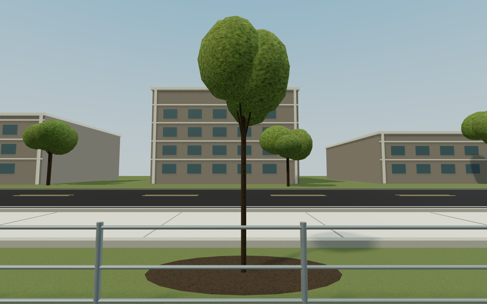
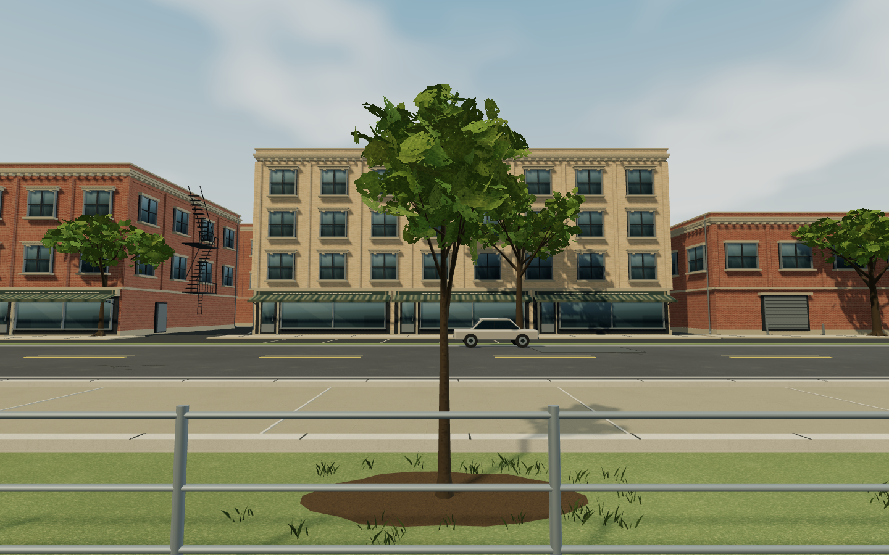
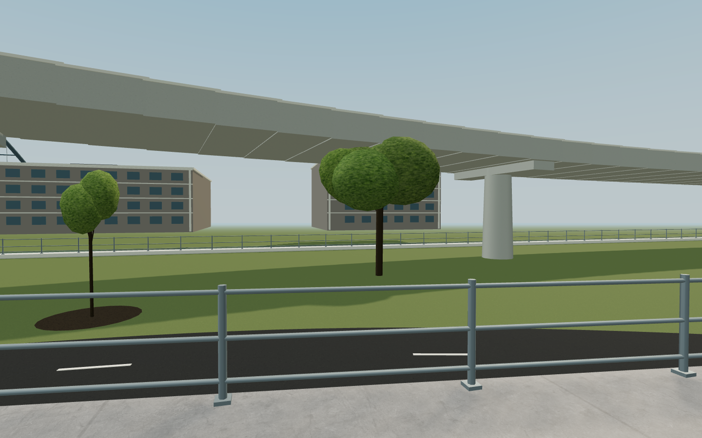
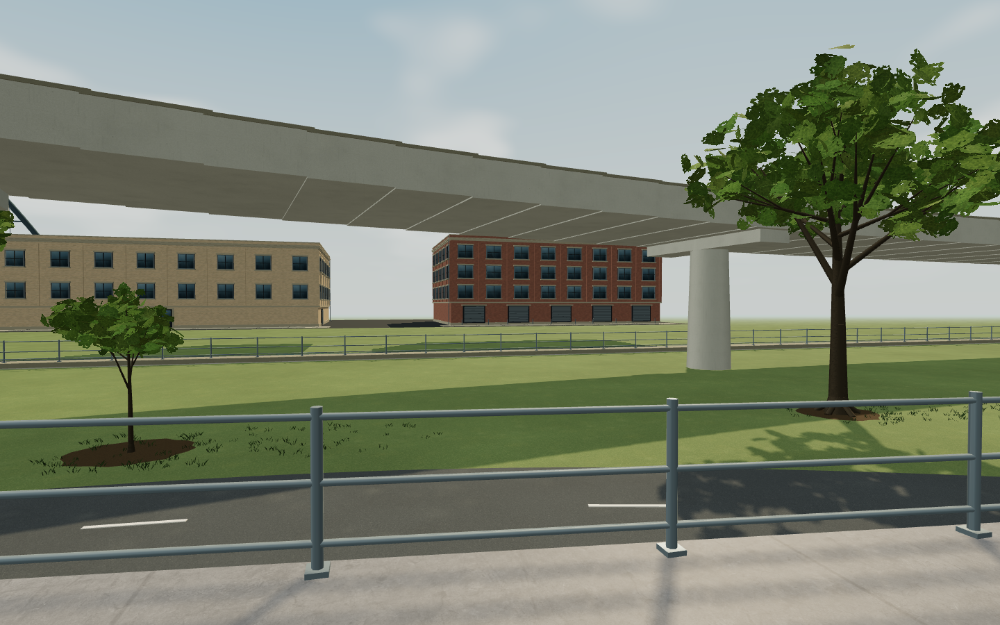
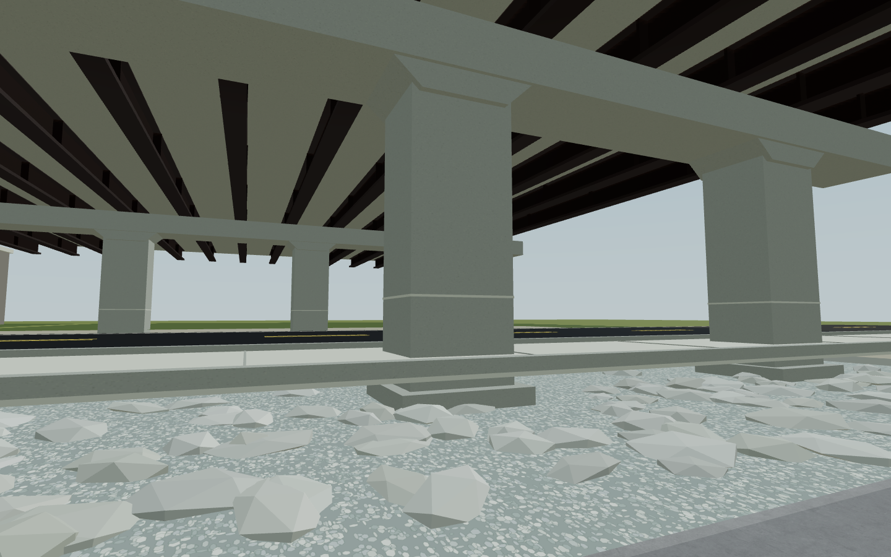
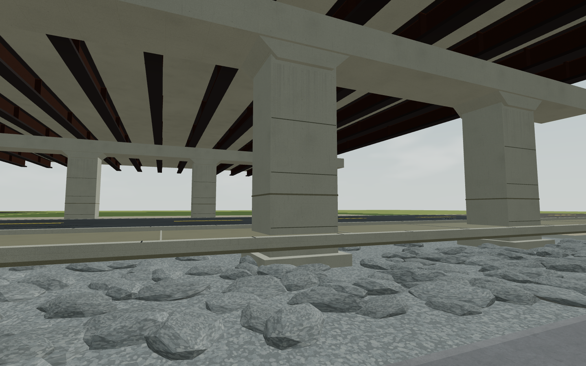
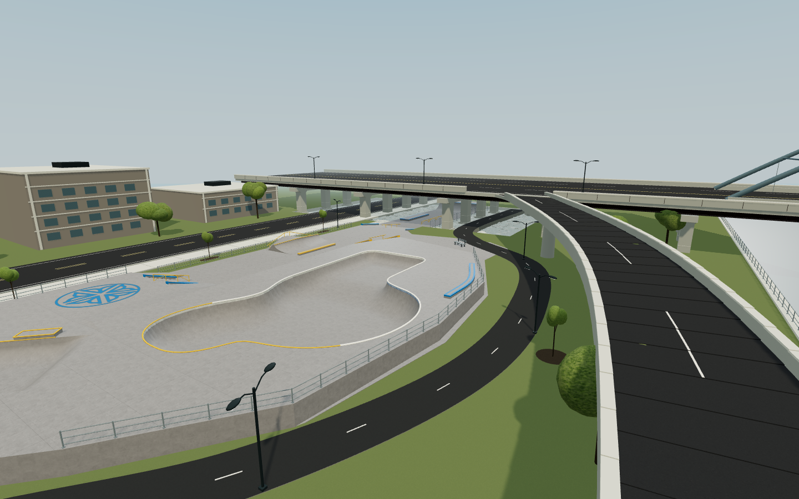

# Riverway environment art

The September 2026 pass gives ROC City Skatepark a warm afternoon Rochester streetscape: pale skating concrete, red and buff masonry, olive broadleaf planting, charcoal asphalt and oxidized bridge steel. The park's authored layout, skating surfaces, physics, characters, progression and controls are unchanged. Genesee Warehouse is the comparison control.

## Reference study

Real photographs were opened and visually inspected before implementation. These informed proportions, material choices and placement; they are not bundled as game textures.

| Reference | Observed detail and resulting decision |
| --- | --- |
| [ROC City park photographs and drawings](https://roccitypark.org/wp/the-park/) | Keep the skateable concrete bright, the blue/yellow accents readable, and planting beyond the perimeter. Preserve the existing Phase 1 footprint. |
| [North entrance photograph](https://roccitypark.org/wp/wp-content/uploads/2021/04/01_IMG_3294.jpg) | Varied tree ages and branching silhouettes; small planting pockets rather than uniformly repeating green spheres. |
| [Street deck photograph](https://roccitypark.org/wp/wp-content/uploads/2021/04/05_IMG_3312.jpg) | Human-scale urban backdrop and several distinct rooflines; retain the existing distant skyline silhouettes. |
| [Underpass photograph](https://roccitypark.org/wp/wp-content/uploads/2021/04/06_IMG_3304.jpg) | Pale concrete piers, dark steel beam depth, restrained runoff staining and gray rock beds alongside the promenade. |
| [South Avenue storefront photographs](https://happyearthtea.com/blogs/blog/happy-earth-tea-relocation-update) | Warm masonry, tall windows, cornices, recessed doors, storefront glazing and modest awnings. |
| [Rochester Riverway photographs](https://archive.strongtowns.org/journal/2020/2/25/the-trouble-with-bike-infrastructure-in-snowy-cities) | Layered branching, porous crowns, varied verge planting and clear separation of path and landscaping. |
| [Stantec project context](https://www.stantec.com/en/projects/united-states-projects/r/roc-city-skatepark) | The park is framed by river, trail and elevated urban infrastructure; keep those relationships legible. |

The new nearby buildings, parked cars and planting arrangements are artistic interpretations of Rochester materials and scale. They are not surveyed reproductions of individual properties. All new surface maps and foliage are original procedural art.

## Implementation

- Eight masonry buildings with varied heights and facades, dimensional sills/lintels, cornices, storefronts, entrances, awnings, fire escapes, rooftop equipment and paved frontages. Architecture merges into nine material batches, with reduced distant detail on the mobile profile.
- Twenty-seven varied trees with tapered, branching trunks, root flares, irregular crowns and small alpha-tested broadleaf clusters. Four shared vegetation batches include mulch and short verge grass. Planting is kept out of the park, trail and underpass approaches.
- Fine-grain grass, concrete and asphalt, restrained world-space color variation, curb joints, drainage grates, utility patches, hairline street cracks, covers, a crossing, signs and utility cabinets. Three parked sedans provide a familiar scale cue; their body proportions and circular wheels are independent of the park's 1.25 horizontal scale.
- Concrete formwork and light runoff, oxidized beams, embedded irregular gray riprap and a quieter aggregate bed. Warmer directional light, cooler sky fill, dappled shadows, subtle clouds and longer atmospheric depth unify the scene.
- All scenery remains owned by the outdoor art lifecycle. Shared texture disposal is deduplicated. The existing level-select thumbnail is refreshed from the real rendered scene.

## Three reviewed passes

The baseline is public v14, source `272adec3c52c070269ba24b1e2943248c7714f4a`. PR #24 was then squash-merged as `49f0017809a900096ca1a40c1cbbd152a01157e2`; its only later difference from that visual baseline was a geometry-test correction. This work starts from that synced main commit on `codex/riverway-environment`.

1. **Composition and material pass:** replaced the flat facades, sphere crowns and plain road surfaces. Actual close and wide renders exposed fern-like foliage, overly mottled concrete, striped pier staining, blocky cars and bright outlined gravel.
2. **Shape and restraint pass:** rebuilt crowns with smaller leaves, mixed orientations and more internal volume; darkened and thinned grass blades; softened surface weathering; tapered the car bodies and replaced the rocks. New screenshots showed a remaining brown-stone/pale-gravel mismatch. Source review also found windshield intersection and stretched wheels; both were corrected.
3. **Final coherence and runtime pass:** brought stone and gravel into the same restrained palette, removed heavy gravel outlines, reduced mobile rock geometry and verified the final car proportions. Inspected matching desktop/touch close views, wide views, and frames captured during real touch-driven skating. No remaining blocking visual or traversal issue was found.

Before and final captures use the same nine camera definitions, FOV and viewport sizes: 1440×900 desktop and 844×390 touch landscape. Eight cover the outdoor environment, including entry, street, trees, ground edges, bridge and overview; the ninth is the Warehouse control. Reports include all measurements. Representative intermediate frames are also versioned.

| View | Before | Final |
| --- | --- | --- |
| Street and storefronts |  |  |
| Trail trees |  |  |
| Bridge materials |  |  |
| Whole park |  |  |

## Validation and measured cost

- Production build succeeds. Vite still warns that the main JavaScript chunk exceeds 500 kB; final main is about 894 kB / 265 kB gzip.
- `npm run sim:roccity`: **101 passing** layout, support, collision, route, linked-grind, fixture, progress, scale and art lifecycle checks. Art now verifies all data and transforms for **207 colliders and 248 linked rails**, before/after creation, animation and disposal, at the shipped 1.25 scale. Both quality profiles release their owned resources exactly once and rebuild cleanly.
- `npm run sim:transitions`: **38 passing** quarter-pipe, coping, landing and flat-ground regression checks.
- `npm run sim:level`: goal/save isolation, session timing, pickup reachability, a complete SKATE route and score/combo routes pass.
- [Final browser report](screenshots/environment/final/report.json): **4/4 checks**, 22 actual game screenshots, no browser or WebGL errors. Native multi-touch input traverses **76.46 m in eight simulated seconds**, lands an ollie, has zero bails, and finishes riding the underpass floor with all touch state released.
- Eight round trips between cached levels (16 switches) show identical scene, geometry, texture and shader-program counts across six post-warmup samples. The Warehouse touch control PNG is byte-identical to baseline; its desktop render workload is unchanged.

| Fixed wide view | Before desktop | Final desktop | Before touch | Final touch |
| --- | ---: | ---: | ---: | ---: |
| Draw calls | 394 | 412 | 395 | 413 |
| Triangles | 136,527 | 348,333 | 131,359 | 230,891 |
| Resident geometries | 650 | 670 | 645 | 665 |
| Resident textures | 90 | 100 | 89 | 99 |

Static batching keeps the additional draw calls to 18 in this view. The touch profile has simpler rocks, fewer foliage cards, reduced architecture detail and no outdoor shadow map. Desktop outdoor shadows increase from 2048² to 4096² (four times the shadow-map pixels), improving foliage shadows at a real GPU/memory cost.

The rough median elapsed time around deterministic headless application frames was **8.50 → 9.00 ms desktop** and **6.42 → 6.25 ms touch**. These include JavaScript, render submission and scheduler yields. They are **not display FPS, GPU timings or a physical-phone benchmark** and do not establish a mobile speedup. Counts include the existing game and its cached resources, not only new scenery.

Reproduce the browser comparison in PowerShell after building and starting preview on port 4176:

```powershell
$env:QA_BASELINE_REPORT = 'screenshots/environment/before/report.json'
$env:QA_FINAL = '1'
node sim/environmentcheck.js http://127.0.0.1:4176 screenshots/environment/recheck
```

## Remaining limits

This is a substantial procedural-art upgrade within the current Three.js renderer, not photogrammetry or AAA production assets. Foliage cards, repeated masonry modules and simplified parked cars remain visible up close. Distant ground and skyline are deliberately sparse, buildings have no enterable interiors, and lighting has no baked indirect illumination or screen-space ambient occlusion. New street props are decorative beyond the skating boundary. Mobile checks use headless touch emulation; physical-phone thermal, battery and frame-rate testing remains outstanding.
