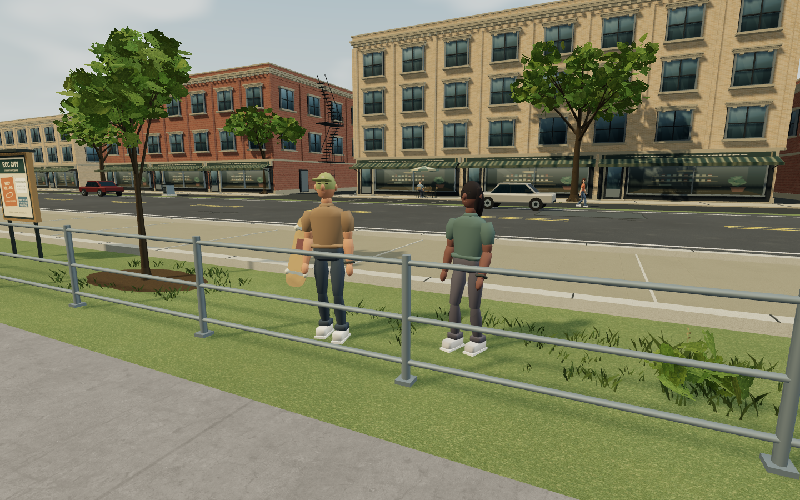
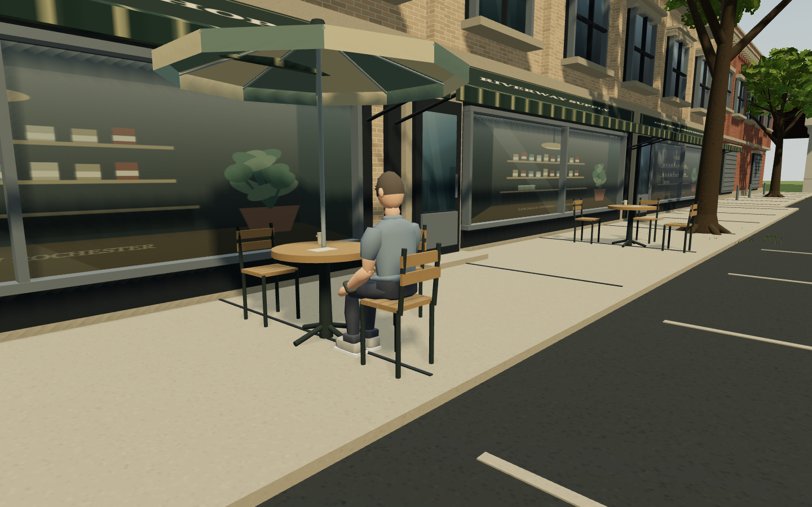
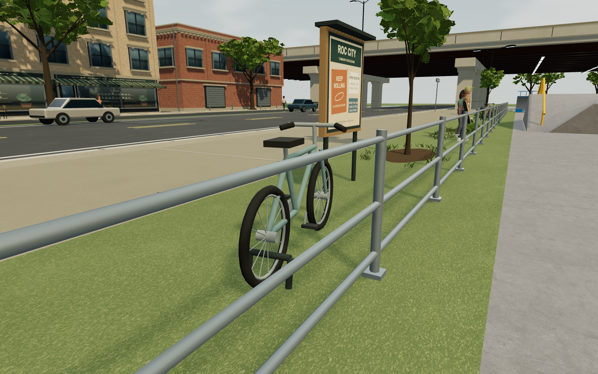

# A lived-in Riverway

This follow-up builds on the first environment overhaul in [ENVIRONMENT-ART.md](ENVIRONMENT-ART.md). The v15 scene had convincing new facades and foliage but still read as an empty set. The direction for this pass is an ordinary afternoon at the park: a few friends watching, people on the sidewalk, a small cafe terrace and a light breeze.

## What changed

- Eight ambient people: three walkers across South Avenue, two friends near the north bench, two spectators outside the east fence, and one seated cafe patron. They have distinct clothing, hair, bags and held skateboards. Slow head/arm movement and varied walk phases make the activity visible without occupying skating lines.
- Two parked bikes with spokes, handlebars, pedals and supports; two bins; a community noticeboard; a bag and drink by the bench; two cafe tables with chairs, cups and one umbrella. The shop windows now suggest shelves, a counter, pendant lights and plants behind their reflections.
- Eleven low planting pockets, varied shrubs and seedheads connect some of the isolated tree beds. Small mown clearings keep the spectators' shoes and the bench bag out of the plants.
- Gentle foliage and grass movement, matching animated foliage shadows, and slowly drifting clouds. The existing river movement shares the same ambient clock. Operating-system reduced-motion preference freezes these environmental animations; skating and input remain independent.

The people and new furniture are decorative outside the park and trail, with no new collision bodies. Their familiar dimensions are kept in world metres even though the park has a wider 1.25 horizontal footprint. People are lightweight instanced rigs, not additional player characters or AI skaters. Walking paths are continuous loops with curved turns, not visible endpoint teleports.

## Review and corrections

Started by running v15 and capturing nine actual game views again. First implementation screenshots were then inspected at matching cameras and closer views of the people, bikes, cafe and planting.

That review led to a second polish pass: relaxed the overly bent idle knees, softened elbow/forearm joins, varied hand poses, cleared shrubs around the friends, and added restrained shop-window detail. Geometry review found the cafe chair spanning a pavement step; the furniture and patron were moved together and the feet aligned to the actual paving. A noticeboard post overlapped a young tree, so the board was relocated to the clear, lower street-side verge.

Final views were inspected on desktop and touch profiles. Two fixed timestamps demonstrate moving leaves, shadows and people. A separate reduced-motion check examines both animation state and rendered output.

## Validation

- `npm run sim:roccity`: 101 checks pass, including complete preservation of all 207 colliders and 248 linked rails, resource cleanup, routes, fixtures and progression.
- `node sim/roclifetest.js`: six checks pass. Both quality profiles are sampled across 200 seconds of walking, including turnarounds and loop seams. Tests check finite transforms, human scale, planted feet, full-body and prop clearance, and actual cafe seat/foot support with mesh raycasts.
- `npm run sim:touch`: ten checks pass for the existing input merger, charge/release behavior and cancellation.
- `npm run qa:life -- <preview-url> <output-directory>` captures matching and close views, checks animation and matching foliage shadow clocks, and tests reduced-motion behavior. The baseline defaults to the committed v15 report.
- `npm run qa:environment -- <preview-url> <output-directory>` retains the shared fixed-camera workload audit. Set `QA_FINAL=1` to include native touch traversal and repeated cached level switching.

Geometry for the eight people uses nine instanced draw calls and about 14,000 triangles. Wind updates a shared shader uniform rather than rebuilding leaves or grass on the CPU. The props are batched by material, and the mobile profile retains reduced planting/detail and disabled outdoor shadows. All maps are generated locally; no external content or new runtime download is required.

Final browser reports: [ambient life, 6/6](screenshots/environment/life-final/report.json) and [runtime, 4/4](screenshots/environment/life-runtime/report.json), with no browser or WebGL errors. Reduced motion produced exactly zero changed pixels between the two measured timestamps on both profiles. Native touch input travelled 76.46 m, completed an ollie and landing, and produced no bails or stuck touch ownership. Six samples after warmup across 16 level switches stayed at 818 objects, 667 geometries, 100 textures and 52 programs. The warehouse rendering workload was unchanged.

Matching full-game wide views, including the player, measured:

| Workload | v15 desktop | This pass desktop | v15 touch | This pass touch |
| --- | ---: | ---: | ---: | ---: |
| Draw calls | 412 | 424 | 413 | 425 |
| Triangles | 348,333 | 379,762 | 230,891 | 253,558 |

Rough headless elapsed time per application frame measured 9.00 → 8.08 ms desktop and 6.25 → 7.33 ms touch. These noisy CPU/render-submission measurements are not display FPS, GPU timings, or a physical-phone performance claim. The fixed art closeups hide the player; their workload should not be compared directly with this full-game table.

## Limits

The ambient people do not skate, react to tricks or interact with the player. Storefront interiors are inexpensive painted vignettes rather than enterable rooms. Furniture, posters and activity are artistic additions, not surveyed facts about the real park. Close-up rigs and foliage remain stylized, and physical-phone thermal/frame-rate testing remains outstanding.
