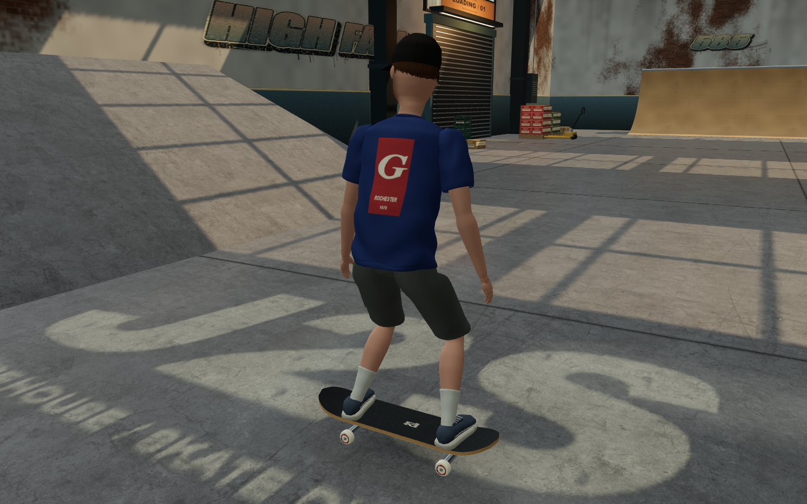
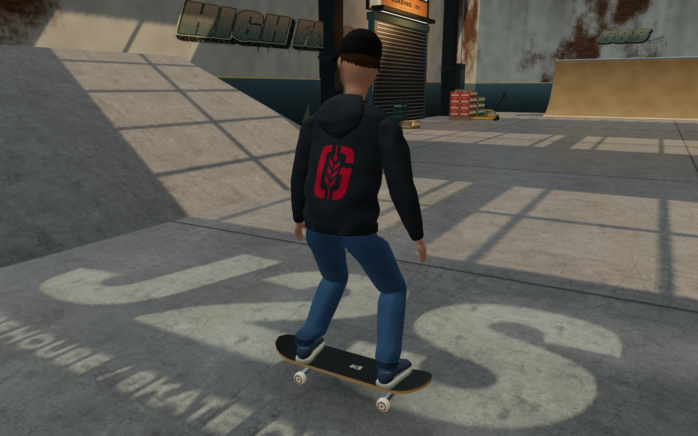
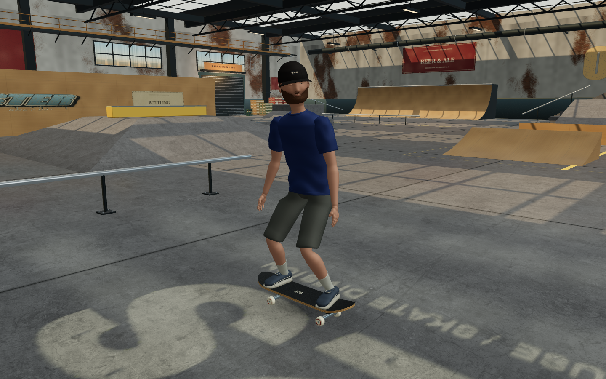
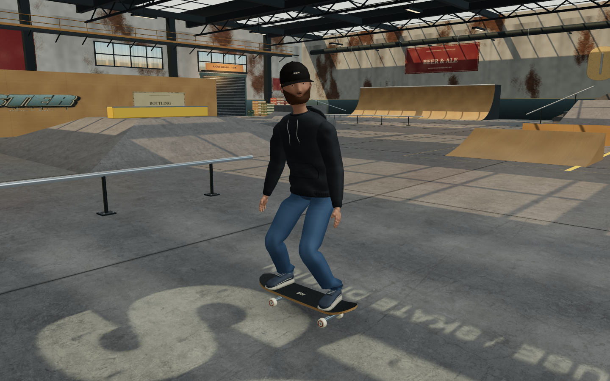
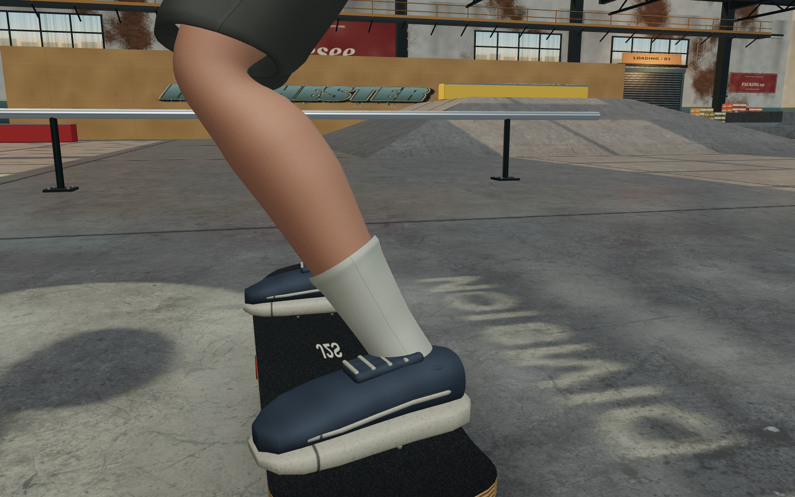
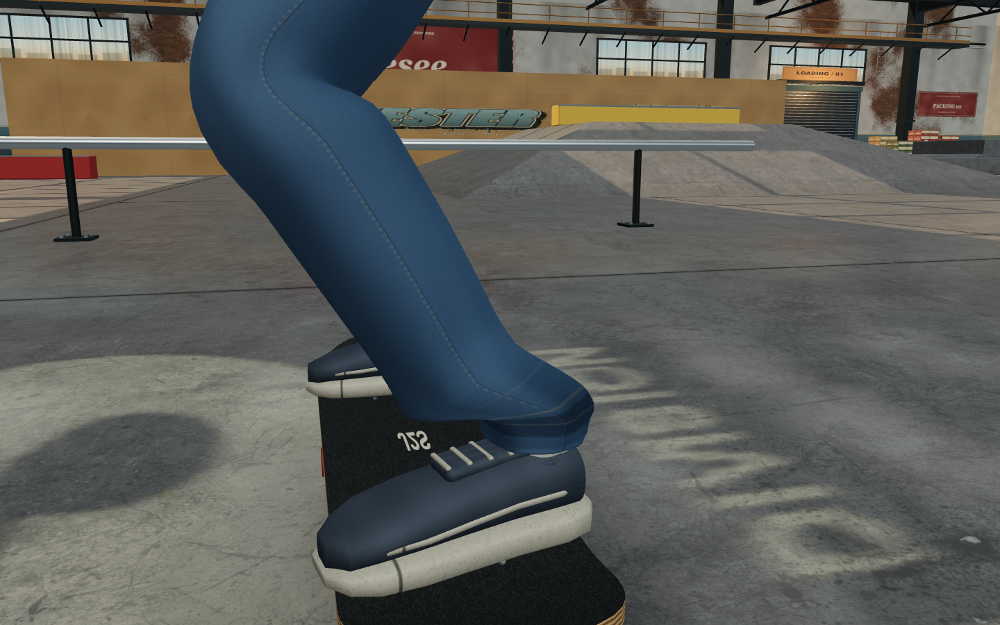

# Jeans and Genesee hoodie

The skater now wears full-length blue jeans and a black pullover hoodie with a red Genesee G on the back. The existing slim proportions, hat, brown hair and beard, heel-aligned shoes, foot planting and forward push are preserved.

## Clothing

- Continuous denim legs replace the shorts and exposed calves. Indigo twill, faded knees/thighs, pocket stitching, rivets, side seams and turned hems give them detail without oversized cargo pockets. The cut stays straight through the calf, with small folds at the knee and ankle.
- Each jean leg blends between the pelvis, thigh, shin and ankle. The finished cuff follows the shoe orientation so it cannot swing through the heel during a push, squat or board catch. The laces and forefoot remain exposed.
- The charcoal-black fleece hoodie has long sleeves, ribbed cuffs and waistband, a lowered hood with an inner surface, a sewn kangaroo pocket and surface-fitted cotton drawstrings with eyelets/aglets. The body and pocket blend between hips and chest during torso twists.
- The red screenprint uses the G-and-stalk vector from the [Genesee website](https://www.geneseebeer.com/), stored with provenance in `src/genesee-mark.js`. It is painted into the fleece texture with light ink wear rather than applied as a floating badge.

The browser inspection prompted a second tailoring pass: rounded the shoulder caps, brought the drawstrings above the chest surface, and reduced the denim's blue saturation. No simulation, input or camera code changed.

## Comparable views

The baseline is the character at `4fd16ebcb7c9f069dd2e48c80f236003c68d244e`, before the outfit edits. Both sets use the same 1440 x 900 viewport, pixel ratio 1, warehouse position, lighting, camera and settled animation pose. These are deliberately posed rig comparisons in the actual renderer; the live captures below use the running game.

| Before | After |
| --- | --- |
|  |  |
|  |  |
|  |  |

There are 14 matched views per set, including crouch, regular/fakie push, kickflip, grab, grind, landing compression, the normal follow camera, and close-ups of the hoodie and hair/hood clearance. Reproduce them with `sim/outfit-capture.playwright.js` through Playwright's `browser_run_code_unsafe` filename argument, with the dev server on `http://127.0.0.1:5173/`. The script uses an isolated browser context and contains the output directory to change for a new baseline.

Live evidence: [regular push](screenshots/outfit-after/live/regular-push.png), [fakie push](screenshots/outfit-after/live/fakie-push.png), [charged crouch](screenshots/outfit-after/live/charged-crouch.png), [Indy grab](screenshots/outfit-after/live/live-grab.png), [landing](screenshots/outfit-after/live/live-landing.png), [rail grind](screenshots/outfit-after/live/live-grind.png), [ledge grind](screenshots/outfit-after/live/live-ledge.png), and [gameplay video](screenshots/outfit-after/live/outfit-gameplay.webm).

## Verification

All of the following passed:

- `npm run build`: 36 modules; JavaScript 704.59 kB / 198.99 kB gzip.
- `node sim/arttest.js`: turned wrist openings, connected palms/shoes and 203 smooth UV seams.
- `node sim/proportiontest.js`: shoulder/head ratio 2.58, slim hips, anchored hoodie hem and connected hand geometry.
- `node sim/headtest.js`: 32,175 collar/face checks across 15 head turns.
- `node sim/pushtest.js`: 1,440 regular/fakie push frames covering forward gaze, foot contacts, knee separation and recovery.
- `node sim/footplanttest.js`: 7,203 deck contacts across 4,339 frames, including crouch, carving, manuals, grinds, grabs, flips and catches; attached jean hip seams and unchanged simulation inputs.
- `node sim/outfittest.js`: 665,280 cuff/shoe checks across 720 blended-pose frames; 25,920 hair/hood checks with at least 36.5 mm vertical clearance at the sampled head rotations; normalized skinning weights and finite geometry.
- `sim/visual-live.playwright.js`: all 23 existing live browser checks passed with the capture directory redirected to `screenshots/outfit-after/live/`. These exercise keyboard and simulated standard-gamepad input, flips that land and score, both push stances, rail sparks, ledge dust, replay, controls/settings and lowfx rendering. There were no runtime, shader or WebGL errors.
- `sim/outfit-live.playwright.js`: captured actual keyboard-driven riding, both push stances, a charged crouch, an Indy and landing using the normal camera and game loop. The grab landed for 300 points. A canvas recording preserves the movement; run resets between the two stances and the jump are intentional.

## Rendering cost and limits

| Same comparison view | Before | After |
| --- | ---: | ---: |
| Draw calls | 143 | 140 |
| Rendered triangles | 215,150 | 218,430 |
| Resident textures | 88 | 89 |

The 360-frame live sample measured median 16.7 ms and p95 16.8 ms on the test machine, approximately 60 FPS. These measurements are diagnostic, not a guarantee for other hardware. The gamepad check uses the standard browser mapping with simulated inputs, not a physical controller.

The character remains a procedural stylized model. Cloth follows the skeleton and authored folds; there is no cloth simulation, self-collision solver or independent drawstring motion. Extreme poses can still look more rigid than a scanned, professionally rigged asset. The existing Vite warning about a bundle larger than 500 kB remains.
