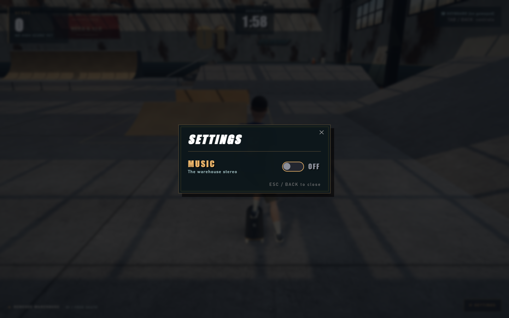
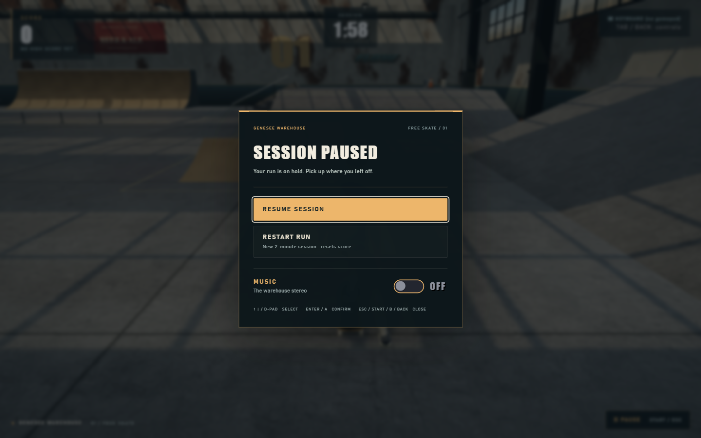

# Pause menu verification

Controller Start now opens the pause/settings menu during a run instead of resetting it.
The menu offers Resume Session, Restart Run and Music. The floating gear is replaced by
an on-screen Pause control (Menu before/after a session). Enter opens pause during play;
Escape toggles it. Start still begins a run from the title/replay screen.

The open modal freezes the fixed-step simulation, exact remaining time, score/combo,
character pose, camera, particles and warehouse dust clock. Skating audio fades out and
controller vibration is stopped; the music setting remains usable. Closing the menu
clears queued edges and discards elapsed pause time. Held menu keys/buttons/sticks must
return to neutral before skating again. An interrupted ollie charge cancels on resume,
preventing an unintended pop when the button was released in the menu.

The dialog keeps keyboard focus inside and makes background controls inert. Navigate
using arrows, Tab/Shift+Tab, the D-pad or left stick; confirm with Enter/Space or A.
Resume, Escape, controller Start/B/Back and the backdrop close it. Restart explicitly
clears score/combo/effects and begins another two-minute session without changing music.

## Visual evidence

The comparison uses a 1440 × 900 spawn-area view, about 1.1 seconds after starting a run.
The original scene continues moving while settings are open; the new menu freezes it.

| Before | After |
| --- | --- |
|  |  |

Additional captures: [earned score preserved](screenshots/pause-menu/earned-score.png),
[midair](screenshots/pause-menu/midair.png), [rail grind](screenshots/pause-menu/grind.png),
[phone](screenshots/pause-menu/phone.png), [landscape](screenshots/pause-menu/landscape.png).

## Validation — September 8, 2026

- `npm run build`: passes (35 modules, JS 697.98 kB / 196.57 kB gzip).
- `npm run sim:menu`: passes native button activation, Escape/Start edges, keyboard and
  controller isolation, held-input release and haptic cancellation tests.
- `sim/pause-menu.playwright.js`: **44 checks pass** in an isolated Chromium context.
  Checks real riding, airborne and rail-grind pauses against complete pose, physics,
  camera, effect-pool, HUD and exact session-time snapshots over a 1.1-second hold.
  Rendered-scene comparisons also pass, allowing fewer than 100 color channels to
  round by at most 1/255 between GPU draws (observed maximum: 13 channels).
  Also covers controller navigation/confirmation/cancel/restart, safe crouch release,
  fresh A-button ollies after resume, audio bus muting, vibration reset calls, focus
  containment, music persistence, replay, backdrop and on-screen Pause, low-effects mode,
  and 390 × 844 / 844 × 390 / 1440 × 900 layouts. No runtime, shader or WebGL errors.
- Existing `sim/visual-live.playwright.js`: **23 checks pass**, including regular/fakie
  pushes, keyboard/gamepad ollies and flips, landing score, reverts, rail/ledge effects,
  controls/settings, replay and low-effects gameplay. Its output was redirected to
  `screenshots/pause-menu/regression/` to preserve the earlier visual evidence.
  The 360-frame sample measured median **16.7 ms**, p95 **16.8 ms** on this test machine.

Run either browser script through Playwright's `browser_run_code_unsafe`, passing its
absolute path as `filename`, with the Vite server available at `http://127.0.0.1:5173`.

Controller input and actuator calls were verified using a simulated standard gamepad;
physical rumble feel was not tested. The existing Vite bundle-size warning remains.
The separate Tab/Back controls-reference panel retains its previous behavior; the
pause/settings dialog is what pauses gameplay. Changes are proposed on top of the
Genesee visual-upgrade branch, so that visual PR should land before this one.
