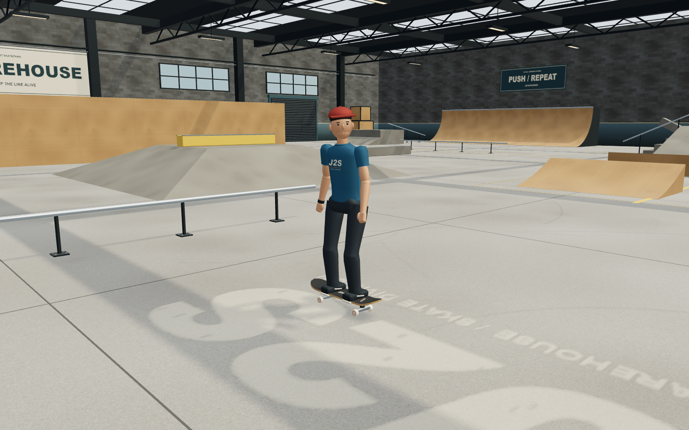
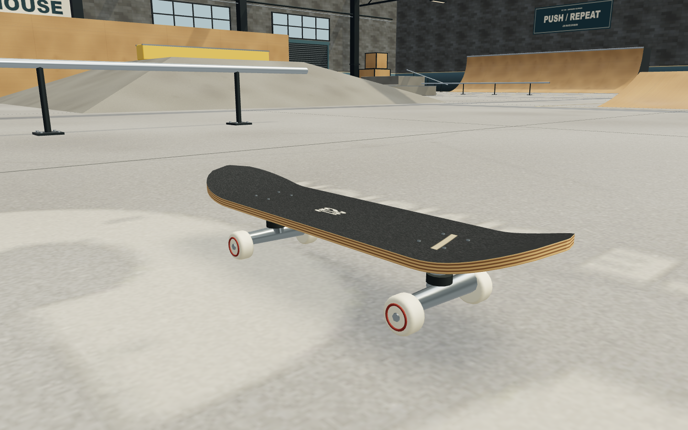
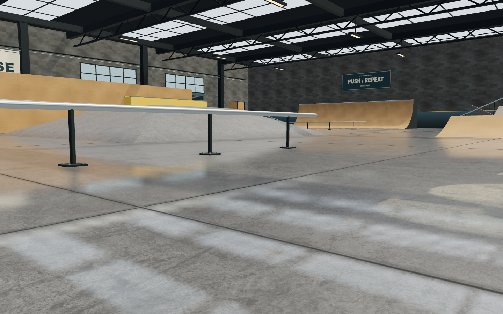

# J2S Pro Skater

A single-level, gamepad-first 3D skateboarding prototype in the spirit of Tony Hawk's Pro Skater 1.
The point of this build is **game feel**: the skater controller, camera and animation are one
hand-tuned kinematic system (no rigid-body physics), and every number in it was play-tested.

## Demo

[](https://youtu.be/jho32KbQ5aQ)

_[Watch the gameplay demo on YouTube](https://youtu.be/jho32KbQ5aQ)._

## Run it

```bash
npm install
npm run dev        # http://localhost:5173
```

Plug in an Xbox-style (XInput / "standard mapping") USB controller, press any button, skate.
Keyboard works as a fallback. Press **Back** (gamepad) or **Tab** to show the full control map in game.

`npm run build` produces a static bundle in `dist/`; `npm run preview` serves it.

## Controls (gamepad)

| Input | Action |
|---|---|
| Left stick | Analog steering on the ground, spin in the air, trick direction, **balance while grinding** |
| Left stick ↓↑ flick | Manual (↑↓ for Nose Manual). Flick in the air to land in one. While manualling the vertical axis balances the pitch — you can't push on two wheels, so it's free |
| A (hold) | Crouch **= speed up** (THPS style); release to ollie – longer hold = bigger pop (0.55 s to full) |
| X + direction | Flip trick (Kickflip, Heelflip, Pop Shove-it, Impossible, 360 Flip, Varial Heel, Hardflip, Inward Heel). Can be pressed during the crouch or on the release frame – it fires on takeoff |
| B + direction | Grab trick (hold; Indy, Melon, Nosegrab, Tailgrab, Method, Stalefish, Judo, Airwalk) |
| Y + direction | Grind – a tap in the air arms a 0.6 s window; any rail within 2.6 m pulls you onto it like a magnet, coping included (50-50, Nosegrind, 5-0, Boardslide, Lipslide, Crooked, Overcrook, Smith, Feeble) |
| Left stick down | Brake |
| Left stick up | Extra push – optional, the skater pushes by himself below 5.4 m/s on flat |
| L2 / R2 (ZL / ZR, LT / RT) | Revert left / right anywhere on the ground to toggle regular/switch. On ramp landings, flick into a manual to keep the combo. Triggers no longer push or brake |
| LB / RB | Spin left / right (digital, handy with the d-pad) |
| Right stick | Nudge the camera |
| Start | Start the 2-minute free skate; pause / resume during play |
| Back | Toggle the controls panel |

Keyboard: arrows / WASD, Space (ollie), J (flip), K (grab), L (grind), Q/E (spin), Z/C (revert), Enter (start / pause), Escape (pause / resume), Tab (controls).

Start, Enter or the on-screen Pause button opens the pause/settings menu during a run. Resume keeps
your position, score and remaining time; Restart Run explicitly resets the session. Navigate with
Up/Down, Tab/Shift+Tab, the D-pad or left stick; select with Enter/Space or controller A. Escape,
Start, controller B/Back, Resume or the backdrop closes it. Music remains adjustable while the
simulation, animations, effects, timer and skating audio/haptics pause. Held menu inputs must be
released before skating again; an interrupted ollie charge cancels to avoid an accidental pop.
Before a run, use Escape or Menu for settings. See [pause verification](PAUSE-MENU.md).

## What is in the box

- `src/skater.js` – the controller. States: ride, air, grind, bail. Surface following via raycasts with
  a 3-D travel vector that stays tangent to banks, transitions and vert; ramp-assisted uphill gravity;
  crouch "pump" in transitions; late-release ollie forgiveness at lips; vert airs auto-turn 180;
  forgiving landing snap (65°) with sketchy-landing speed scrub; rail snapping with a cooldown so rail
  exits are clean; wall splat vs. wall scrub; tiny hops don't break combos. THPS-style input forgiveness:
  flip/grab presses are buffered through the pop, a grind tap arms a magnet window that steers you onto
  the nearest rail, crouch is the accelerator and the skater auto-pushes when slow. All tuning lives in `TUNING`.
- `src/input.js` – Gamepad API (standard mapping) with radial deadzone, analog triggers, d-pad mirror,
  hot-plug detection, and a keyboard fallback smoothed to behave like a stick. Key taps are latched so
  they can never fall between frames.
- `src/character.js` – procedural skater and board with pose blending (ride, push cycle,
  crouch, air, per-trick flip/grab poses, grind, bail tumble), board flip animation per trick, carve lean.
- `src/camera.js` – third-person camera that follows travel direction (not body spin), pulls back with
  speed, anticipates spins, opens the view for grinds, avoids walls, never rolls, and layers spring-driven
  landing/bail impacts over the stable follow path.
- `src/level.js` – warehouse park: half pipe, two quarter pipes, long bank, raised platform with bank
  approach, 5-stair with handrail and hubba, pyramid fun box with ledge, kicker→rail line, kicker gap,
  two ledges, flat rails, a down bar. Also builds the raycast colliders and grind segments.
- `src/tricks.js` – trick tables, spin naming and the combo maths, priced from
  [`THPS-SCORING-SYSTEM.md`](THPS-SCORING-SYSTEM.md). See [Scoring](#scoring).
- `src/highscores.js` – the best-runs table, persisted to `localStorage` and rendered on the title and
  end-of-run overlays. Stored data is re-validated on load, and every access is guarded so a browser
  with storage blocked simply keeps the table in memory for the session.
- `src/settings.js` – player preferences, persisted to `localStorage` with the same guarded access as
  the high-score table. Music is off by default; the pause/settings menu controls it, and switching
  it on is the gesture that starts the audio context.
- `src/balance.js` – the balance meter, as an inverted pendulum. One class, two tunings: `BALANCE` for
  grinds (roll axis, stick X) and `MANUAL_BALANCE` for manuals (pitch axis, stick Y). Standalone with an
  injectable rng so it can be tested on its own (`npm run sim:balance`).
- `sim/playtest.js` – headless Node harness that drives the controller through scripted lines
  (push/coast, brake, carving, ollie heights, flips, quarter pipe, half pipe pumping, kicker→rail,
  boardslide, stairs, gap, wall). `npm run sim` prints state timelines; use it when re-tuning.
- `sim/feeltest.js` – deterministic camera, haptic-mixing and 180° spin-tick checks (`npm run sim:feel`).
- `sim/scoretest.js` – pins every point value and combo rule to the scoring document, and exercises the
  high-score table against corrupt and unavailable storage (`npm run sim:score`).

## Scoring

Point values and the combo maths come from [`THPS-SCORING-SYSTEM.md`](THPS-SCORING-SYSTEM.md), so a run
here lands in the same range it would in Tony Hawk's Pro Skater 1+2:

```
Final Score = Σ(base × stance × degradation) × combo multiplier
```

- **Base values** by tier. Flips are all 100 — in THPS the direction you pick buys variety, not points.
  Grabs are 300 standard (Indy, Melon, Nosegrab, Tailgrab, Method, Stalefish), 350 advanced (Judo) and
  50 weak (Airwalk). Grinds are 100 basic (50-50, Nosegrind, 5-0), 125 advanced (Crooked, Overcrook,
  Smith, Feeble) and 200 for slides (Boardslide, Lipslide). Manuals are 100.
- **Multiplier** is the length of the chain: every trick adds 1x, and every completed 360 of rotation
  adds another. There is no cap — a 20-trick line really is x20.
- **Degradation** punishes repetition inside a combo: 100%, then 75%, 50%, 25%, and 10% from the fifth
  use on. It resets when the combo banks.
- **Switch** (riding fakie) pays 1.2× and counts as a different trick, so it gives a worn-out trick a
  fresh start. Switch tricks read as `Switch Kickflip` in the combo line.
- **Rotation** pays into the base of the trick it was thrown with, escalating hard: 180 is 100, 360 is
  250, 540 is 450, 720 is 700, and every further half-turn adds 400.
- **Holding** pays flat and undegraded: 100/s on a rail, 50/s in a manual, 100/s on a grab held past its
  minimum tuck. Length is worth something; it is not worth as much as another trick.
- **Reverts** change stance and scrub speed anywhere on the ground, including during manuals.
  A timed ramp-landing revert adds zero base points and one multiplier to connect into a manual.
  Other stance changes add no score or multiplier and never refresh the combo window or balance.
- Gaps are the one multiplier source from the document that is not implemented — the warehouse has no
  named gaps to clear yet.

`npm run sim:score` asserts all of the above and prints a sample line.

### High scores

Finished runs go into a ten-deep table in `localStorage`, newest ranking applied at the moment the clock
hits zero. The best of them shows under the live score as `SCORE TO BEAT`, in small type so it never
competes with the number you are watching; pass it and the line turns green and reads `NEW RECORD`. The
full table appears on the title screen and after a run, with the run you just finished highlighted.
Restarting mid-run abandons it without recording anything.

## Tuning notes (the numbers that matter)

- Gravity 22 m/s²: snappier than earth, floaty enough for tricks. Tap ollie ≈ 0.9 m / 0.57 s,
  full crouch ≈ 1.7 m / 0.79 s. Flip tricks take 0.38–0.55 s so a tap ollie can still land a kickflip.
- Holding crouch is the fastest way to move: 9.5 m/s² up to 10.8 m/s, above the 9.6 m/s stick push, so it
  reaches 9.3 m/s in a second and tops out in about 1.4 s. The skater auto-pushes to 5.4 m/s on flat so you
  never crawl; stick-up push still works on top. Rolling friction is gentle.
- Grind magnet: a tap of Y arms 0.6 s; rails within 2.6 m pull at up to 18 m/s² (4.5 m/s max closing speed)
  and snap from 1.3 m away, even when the rail is up to 0.45 m above the feet. In the sim, a line 1.4 m off
  the flat rail with a single tap becomes a 50-50; the same line without the tap lands on the floor.
- Flip/grab presses on the ground are buffered 0.25 s (indefinitely while crouched) and fire on takeoff, so
  X on the same frame as the A release, or during the crouch, always produces the trick.
- Turn rate 3.1 rad/s at a standstill down to 1.75 rad/s at speed; crouching tightens turns by 30%.
- Spin 560°/s at full stick, so a full ollie is a comfortable 360 and a tap is a 180.
- Reverts accept a fresh trigger tap on the ground at any speed; let the slide finish before tapping
  again to switch back. Airborne taps buffer for touchdown for 0.22 s. For a ramp combo link, tap
  up to 0.22 s before or 0.18 s after a valid ramp/vert landing.
  The wheel slide turns 180° over 0.26 s, keeps travel direction and loses 0.85 m/s. There is a 0.9 s
  window to connect a manual; a buffered flick waits for the transition to flatten. Without a manual
  the combo banks, and simply hopping during that window cannot carry it. The existing balance needle
  and accumulated difficulty survive the connection. `node sim/reverttest.js` covers inputs, timing,
  scoring, balance carryover, invalid landings and foot contact during the slide.
- Uphill gravity is scaled by 0.55 so a pushed run reaches every lip; downhill is full gravity.
- The skater rides regular: left foot forward, chest toward the right of travel. The push cycle plants the
  back foot on the ground beside the deck and strokes nose→tail along the travel axis, with the front leg
  bent so the pushing foot actually reaches the floor.
- Feet stay on the deck: flexing a hip swings the ankle toward the toe side, so on the ground the pelvis
  slides back by that same amount (`legReach`). The feet stay planted with ~1.5 cm over each rail and the
  hips travel back-and-down through a crouch instead of the shoes walking off the toe edge. Airborne the
  pelvis stays put and the board tracks the feet instead — averaged over both legs and capped at 5 cm, so a
  flick trick (a heelflip throws the front leg 0.59 m out) spins the board free rather than gluing it to the
  flicking foot. `node sim/rigcheck.js` prints the per-pose numbers.
- Grind balance is an inverted pendulum: the further you are tipped the harder it pulls you over, and the
  stick applies *acceleration* rather than moving the needle, so the meter carries momentum. Your weight
  also takes ~0.1 s to follow the stick, which is what makes slamming it back and forth overshoot into a
  wobble you cannot outrun. Against a simulated player with 0.14 s reaction lag: no input falls in 2.3 s,
  a light touch lasts ~7.4 s, a heavy hand 4.2 s, frantic 3.9 s. Nothing holds a long rail for free.
  Everything pushing you over is capped at 75% of your full-stick authority, so a lean is always
  recoverable given room; being at the edge *already moving outward* is not, and that point of no return
  is what keeps it tense. Difficulty ramps along the rail, with the combo banked, and as you slow down.
  A fresh balance challenge gets 0.32 s of grace, so the first short rail is forgiving. Within one combo,
  grinds and manuals share the last needle position, velocity, wander and accumulated balance time.
  Air time pauses that state; another rail, a manual or a nose-manual resumes it without new grace.
  Banking, bailing or restarting clears it. `node sim/balancechaintest.js` checks these boundaries and
  verifies that repeated short hops cannot keep an uncorrected rider balanced forever.
- Manuals run the same pendulum on the pitch axis, tuned tighter: quicker to run away (2.2 s with no input
  vs 2.3 s on a rail) but quicker to correct, and it ramps faster, so a manual is a connector between
  tricks rather than somewhere to park. Entry is a down-up flick that **only arms from centre** — that one
  rule is what stops the ordinary push-then-brake sweep, which crosses both thresholds, being read as a
  manual. On two wheels you can't push, pump or brake, which is both correct and what frees the whole
  vertical stick axis for balancing. Ollie out and the combo carries on; roll to a stop and it banks.
- The balance HUD follows the skater on screen: a tapered yellow/red arc above the head for grinds,
  or a vertical arc on the left for manuals, with a cyan pointer moving along the curve.
- Camera: ordinary riding follows 2.9–3.46 m behind with a 52–56° FOV, framing the skater at roughly
  half the viewport height. Grinds ease out to 4 m and 56° for rail visibility. Air spins lead by up to 8°
  while the base camera continues following travel, so rotation remains readable. Landings drive a short
  down/back spring punch; only hard landings shake, while bails use the full filtered shake envelope.
- Haptics: a per-frame mixer lets feedback overlap without motors fighting. Ollie charge rises under the
  low-frequency motor, every scored 180° gives a short high-frequency tick, landings scale with impact,
  and grinds buzz continuously. Metal drives the high motor; concrete ledges use a coarser low rumble.
  Grind/manual balance error is layered over the surface texture and grows sharply near failure.

## Graphics

The game uses Three.js physically based materials, image-based lighting, soft shadows,
and ACES filmic tone mapping. The visual upgrade preserves that lighting setup and the original
controller, collision geometry, camera, and pose timing.

- Detailed procedural skater: shaped clothing, fabric bump maps, rounded anatomy, cap, shirt graphics,
  and skate shoes with separate soles and laces, on the original animation rig.
- Continuous concave skateboard deck with curved nose/tail, grip tape, maple laminations, an original
  underside graphic, mounting bolts, trucks, bushings, bearings, and rounded urethane wheels.
- Deterministic local concrete, plywood, masonry, bump and roughness maps. Surface UVs use physical
  scale, with separate expansion joints, worn paint, and wheel marks on the floor.
- Smoother visual quarter-pipe curves, lightly rounded concrete edges, coping, steel toe plates,
  ledge caps and rail anchors. The original colliders remain in use, including in browser builds.
- Warehouse trusses, fixtures, windows, loading doors, utility pipes, signage, and wall art. Static
  dressing is merged by material and excluded from physics and the extra shadow-caster workload.

Most artwork is generated locally once at startup. The floor uses three bundled 2K concrete maps
from [Poly Haven](https://polyhaven.com/a/smooth_concrete_floor) (CC0, Dimitrios Savva), totaling
2.66 MB after JPEG optimization. There are no third-party asset requests at runtime or new package dependencies.
See [texture provenance](public/textures/concrete/SOURCE.md) for source filenames and original checksums.

The concrete floor combines matching color/normal/roughness maps with unique, location-based dirt,
wheel polish, repair fills, and chipped six-metre slab joints. Paint is integrated into that material.
A 512 x 512 reflection pass captures the actual warehouse; mip filtering blurs it according to surface
roughness, and Fresnel weighting makes the sheen stronger at grazing angles. It reuses existing shadows.
The original lights, exposure and collision geometry are unchanged.

Concrete banks, platforms, stairs, hubbas and unpainted ledges are the same pour as the floor: the
same three texture objects, mineral tint, six-metre slab tone variation, and gloss range, so a box top
and the slab beside it match. Their world-scaled mapping keeps detail consistent across differently
sized pieces, and ridden surfaces are burnished while dirt gathers at ground level. Surfaces facing up
enough to catch it re-use the floor's single reflection pass, re-projected from world space; there are
no extra texture downloads, materials, or render passes. The implementation is in
`src/concrete-obstacles.js`.

The existing `?lowfx` URL option disables both shadows and floor reflections and caps pixel ratio at 1.
It retains the floor textures and wear. If texture loading fails, skating continues with the procedural
floor and its paint. The isolated browser check covers this failure case as well as normal and lowfx rendering.
These are detailed stylized assets; they are not scanned or externally authored AAA character assets.

The skater uses narrower, sloped shoulders, a larger head, tapered clothing and a more settled riding
pose. Each hand is one cached, continuous skin surface with finger webbing and a rooted thumb;
`src/hand-art.js` generates those surfaces once, not during animation. Facial contours, eyelids and
surface-fitted lips replace the disconnected facial primitives. Board dimensions and foot anchors
are unchanged. The hoodie hem and pocket blend from hip to chest motion so torso twists do not
pull the elastic waistband through the jeans.

The current outfit is full-length blue denim and a charcoal-black Genesee pullover hoodie.
The hoodie has a lowered hood, a red G back print, drawstrings, a kangaroo pocket and ribbed
trim. The jean cuffs follow the ankles to preserve shoe clearance during pushes and tricks.
See [OUTFIT-UPDATE.md](OUTFIT-UPDATE.md) for matching before/after views, live gameplay evidence
and rendering measurements. `node sim/outfittest.js` checks the cuff and hood clearances.

The warehouse now carries the Genesee G on its floor and main wall sign, plus a Rochester
flower mural and loading-area plaques. Local Barlow fonts connect the warehouse signage
with the menus and HUD. See [WAREHOUSE-IDENTITY.md](WAREHOUSE-IDENTITY.md) for comparisons,
asset sources and production-build checks, including font failure/delay handling.

Art code: `src/materials.js`, `src/skater-art.js`, `src/hand-art.js`, `src/warehouse-art.js`, and `src/concrete-floor.js`.
For repeatable browser visual checks on Windows, run `node sim/graphicscheck.js http://127.0.0.1:5173/`
with the dev server running. It launches a disposable headless Edge profile, verifies rendering and
keyboard/lowfx operation, and saves screenshots under `screenshots/visual-upgrade/`.
The captures include both wrists, the temple/hood opening and the shoe side for close-up polish review.
Run `node sim/arttest.js` to check closed cuffs, tucked sleeve edges, hood lining and smooth UV seams.
Run `node sim/proportiontest.js` to check the shoulder/head ratio, hip-anchored hem and watertight, connected hand geometry.
The dev server ignores generated screenshot directories so QA captures do not trigger page reloads.
Set `EDGE_PATH` if Edge is installed elsewhere. Headless frame timings are diagnostic, not a
performance guarantee for other devices. Existing gameplay checks remain available through `npm run sim`,
`npm run sim:feel`, `npm run sim:balance`, and `node sim/animtest.js`.







### Title Screen


The home page—press START or ENTER to begin a 2-minute free-skate session.

### Kickflip


A kickflip caught mid-rotation: the board spins under the tucked legs while the trick name reads out in the HUD.

### Grind


A 50-50 down the chrome flat rail, sparks trailing off the trucks, with the live combo readout underneath.

### Riding


Carving toward the west quarter pipe at speed, in regular stance with the knees loaded over the deck.
