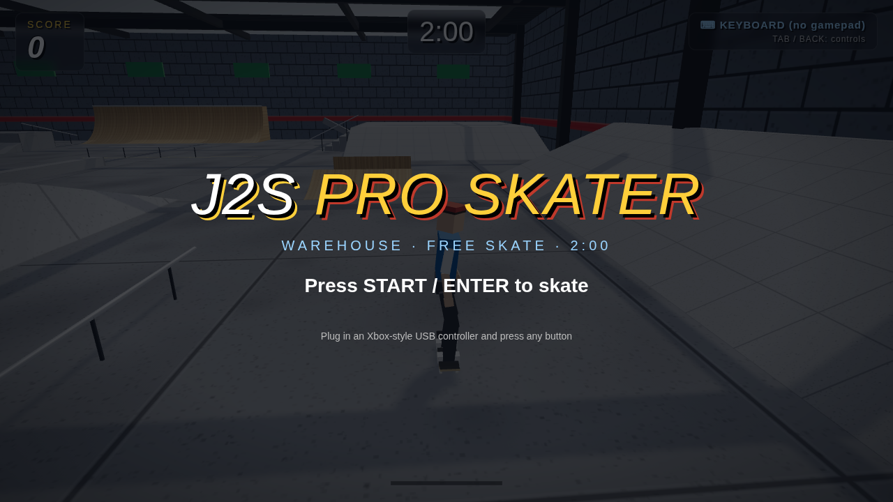
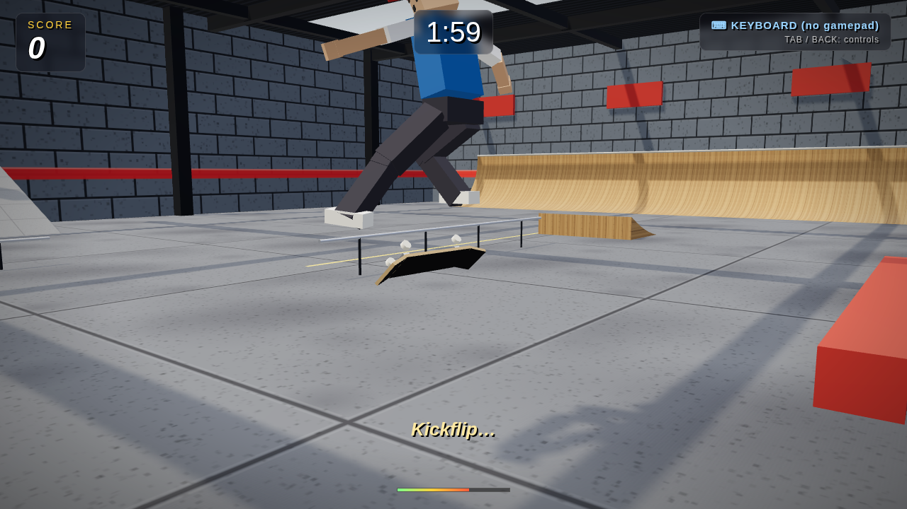
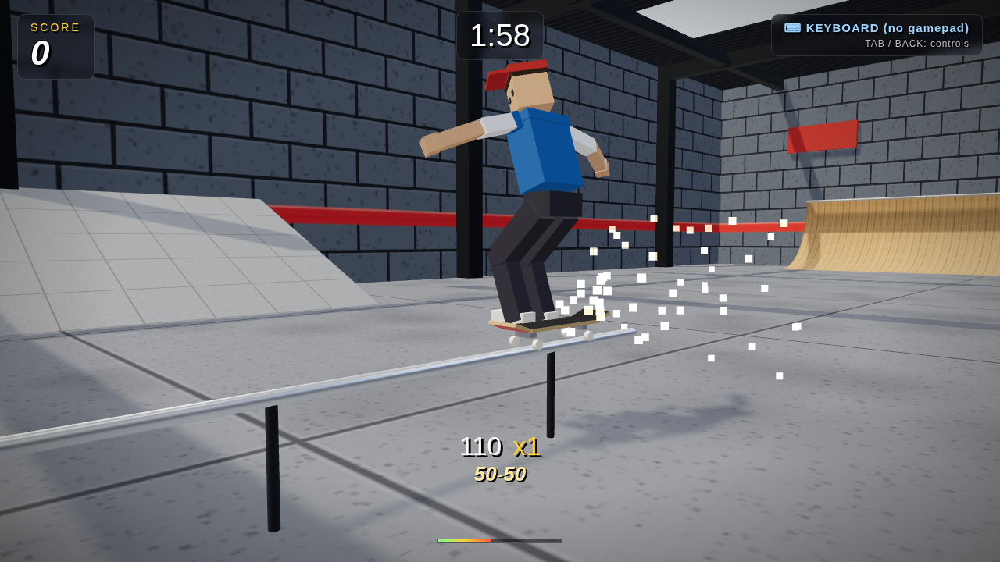
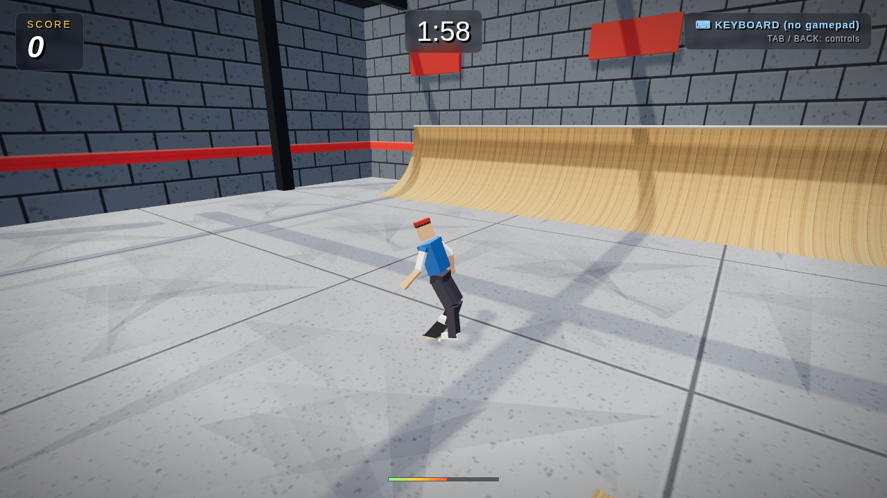

# J2S Pro Skater

A single-level, gamepad-first 3D skateboarding prototype in the spirit of Tony Hawk's Pro Skater 1.
The point of this build is **game feel**: the skater controller, camera and animation are one
hand-tuned kinematic system (no rigid-body physics), and every number in it was play-tested.

## Run it

```bash
npm install
npm run dev        # http://localhost:5173
```

Plug in an Xbox-style (XInput / "standard mapping") USB controller, press any button, skate.
Keyboard works as a fallback. Press **Back** (gamepad) or **Tab** to show the full control map in game.

`npm run build` produces a static bundle in `dist/`; `npm run preview` serves it.

## Controls (gamepad)

| Input | Action |
|---|---|
| Left stick | Analog steering on the ground, spin in the air, trick direction, **balance while grinding** |
| A (hold) | Crouch **= speed up** (THPS style); release to ollie – longer hold = bigger pop (0.55 s to full) |
| X + direction | Flip trick (Kickflip, Heelflip, Pop Shove-it, Impossible, 360 Flip, Varial Heel, Hardflip, Inward Heel). Can be pressed during the crouch or on the release frame – it fires on takeoff |
| B + direction | Grab trick (hold; Indy, Melon, Nosegrab, Tailgrab, Method, Stalefish, Judo, Airwalk) |
| Y + direction | Grind – a tap in the air arms a 0.6 s window; any rail within 2.6 m pulls you onto it like a magnet, coping included (50-50, Nosegrind, 5-0, Boardslide, Lipslide, Crooked, Overcrook, Smith, Feeble) |
| Left stick down / LT | Brake |
| Left stick up / RT | Extra push – optional, the skater pushes by himself below 5.4 m/s on flat |
| LB / RB | Spin left / right (digital, handy with the d-pad) |
| Right stick | Nudge the camera |
| Start | Start / restart the 2-minute free skate |
| Back | Toggle the controls panel |

Keyboard: arrows / WASD, Space (ollie), J (flip), K (grab), L (grind), Q/E (spin), Enter, Tab.

## What is in the box

- `src/skater.js` – the controller. States: ride, air, grind, bail. Surface following via raycasts with
  a 3-D travel vector that stays tangent to banks, transitions and vert; ramp-assisted uphill gravity;
  crouch "pump" in transitions; late-release ollie forgiveness at lips; vert airs auto-turn 180;
  forgiving landing snap (65°) with sketchy-landing speed scrub; rail snapping with a cooldown so rail
  exits are clean; wall splat vs. wall scrub; tiny hops don't break combos. THPS-style input forgiveness:
  flip/grab presses are buffered through the pop, a grind tap arms a magnet window that steers you onto
  the nearest rail, crouch is the accelerator and the skater auto-pushes when slow. All tuning lives in `TUNING`.
- `src/input.js` – Gamepad API (standard mapping) with radial deadzone, analog triggers, d-pad mirror,
  hot-plug detection, and a keyboard fallback smoothed to behave like a stick. Key taps are latched so
  they can never fall between frames.
- `src/character.js` – procedural low-poly skater and board with pose blending (ride, push cycle,
  crouch, air, per-trick flip/grab poses, grind, bail tumble), board flip animation per trick, carve lean.
- `src/camera.js` – third-person camera that follows travel direction (not body spin), pulls back with
  speed, avoids walls, never rolls.
- `src/level.js` – warehouse park: half pipe, two quarter pipes, long bank, raised platform with bank
  approach, 5-stair with handrail and hubba, pyramid fun box with ledge, kicker→rail line, kicker gap,
  two ledges, flat rails, a down bar. Also builds the raycast colliders and grind segments.
- `src/tricks.js` – trick tables, spin naming, THPS-style combo scoring (sum × trick count, repeat decay).
- `src/balance.js` – the grind balance meter, as an inverted pendulum. Standalone and injectable-rng so it
  can be tested on its own (`npm run sim:balance`) and reused if manuals ever land.
- `sim/playtest.js` – headless Node harness that drives the controller through scripted lines
  (push/coast, brake, carving, ollie heights, flips, quarter pipe, half pipe pumping, kicker→rail,
  boardslide, stairs, gap, wall). `npm run sim` prints state timelines; use it when re-tuning.

## Tuning notes (the numbers that matter)

- Gravity 22 m/s²: snappier than earth, floaty enough for tricks. Tap ollie ≈ 0.9 m / 0.57 s,
  full crouch ≈ 1.7 m / 0.79 s. Flip tricks take 0.38–0.55 s so a tap ollie can still land a kickflip.
- Holding crouch is the fastest way to move: 9.5 m/s² up to 10.8 m/s, above the 9.6 m/s stick push, so it
  reaches 9.3 m/s in a second and tops out in about 1.4 s. The skater auto-pushes to 5.4 m/s on flat so you
  never crawl; stick-up / RT push still works on top. Rolling friction is gentle.
- Grind magnet: a tap of Y arms 0.6 s; rails within 2.6 m pull at up to 18 m/s² (4.5 m/s max closing speed)
  and snap from 1.3 m away, even when the rail is up to 0.45 m above the feet. In the sim, a line 1.4 m off
  the flat rail with a single tap becomes a 50-50; the same line without the tap lands on the floor.
- Flip/grab presses on the ground are buffered 0.25 s (indefinitely while crouched) and fire on takeoff, so
  X on the same frame as the A release, or during the crouch, always produces the trick.
- Turn rate 3.1 rad/s at a standstill down to 1.75 rad/s at speed; crouching tightens turns by 30%.
- Spin 560°/s at full stick, so a full ollie is a comfortable 360 and a tap is a 180.
- Uphill gravity is scaled by 0.55 so a pushed run reaches every lip; downhill is full gravity.
- The skater rides regular: left foot forward, chest toward the right of travel. The push cycle plants the
  back foot on the ground beside the deck and strokes nose→tail along the travel axis, with the front leg
  bent so the pushing foot actually reaches the floor.
- Feet stay on the deck: flexing a hip swings the ankle toward the toe side, so on the ground the pelvis
  slides back by that same amount (`legReach`). The feet stay planted with ~1.5 cm over each rail and the
  hips travel back-and-down through a crouch instead of the shoes walking off the toe edge. Airborne the
  pelvis stays put and the board tracks the feet instead — averaged over both legs and capped at 5 cm, so a
  flick trick (a heelflip throws the front leg 0.59 m out) spins the board free rather than gluing it to the
  flicking foot. `node sim/rigcheck.js` prints the per-pose numbers.
- Grind balance is an inverted pendulum: the further you are tipped the harder it pulls you over, and the
  stick applies *acceleration* rather than moving the needle, so the meter carries momentum. Your weight
  also takes ~0.1 s to follow the stick, which is what makes slamming it back and forth overshoot into a
  wobble you cannot outrun. Against a simulated player with 0.14 s reaction lag: no input falls in 2.3 s,
  a light touch lasts ~7.4 s, a heavy hand 4.2 s, frantic 3.9 s. Nothing holds a long rail for free.
  Everything pushing you over is capped at 75% of your full-stick authority, so a lean is always
  recoverable given room; being at the edge *already moving outward* is not, and that point of no return
  is what keeps it tense. Difficulty ramps along the rail, with the combo banked, and as you slow down.
  0.32 s of grace on landing keeps the grind magnet from dropping you straight into a fight, and a short
  rail (the 7 m flat rail is ~1.2 s) is still free — it is the 24 m coping that asks you to work.
- Haptics: landings scale rumble with impact, and grinds buzz continuously for as long as you are on the
  rail. Metal (rails, coping) drives the high-frequency motor; concrete ledges use a coarser low rumble.
  Both scale with grind speed.

## Graphics

The game uses modern Three.js rendering with physically-based materials, image-based lighting, soft shadows,
and ACES filmic tone mapping for a polished look. The procedural low-poly art style (0.84 m tall character,
simple geometric level) keeps the focus on movement and feel while supporting clear visual readout at distance.

### Title Screen



The home page—press START or ENTER to begin a 2-minute free-skate session.

### Kickflip



A kickflip caught mid-rotation: the board spins under the tucked legs while the trick name reads out in the HUD.

### Grind



A 50-50 down the chrome flat rail, sparks trailing off the trucks, with the live combo readout underneath.

### Riding



Carving toward the west quarter pipe at speed, in regular stance with the knees loaded over the deck.
