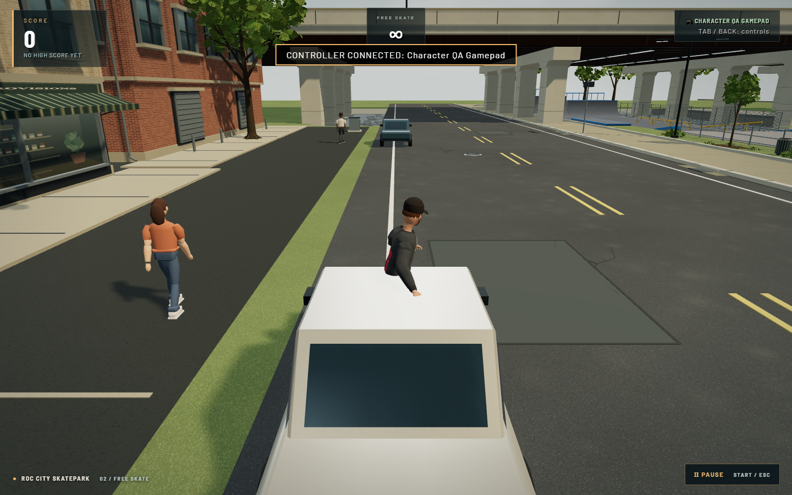
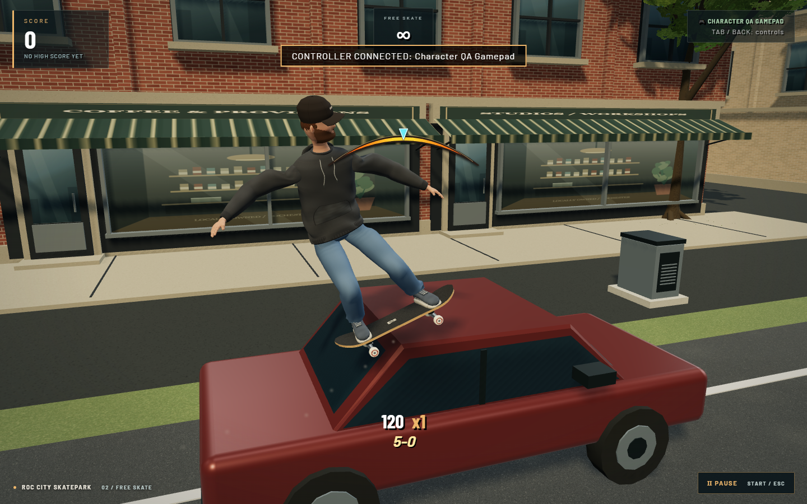
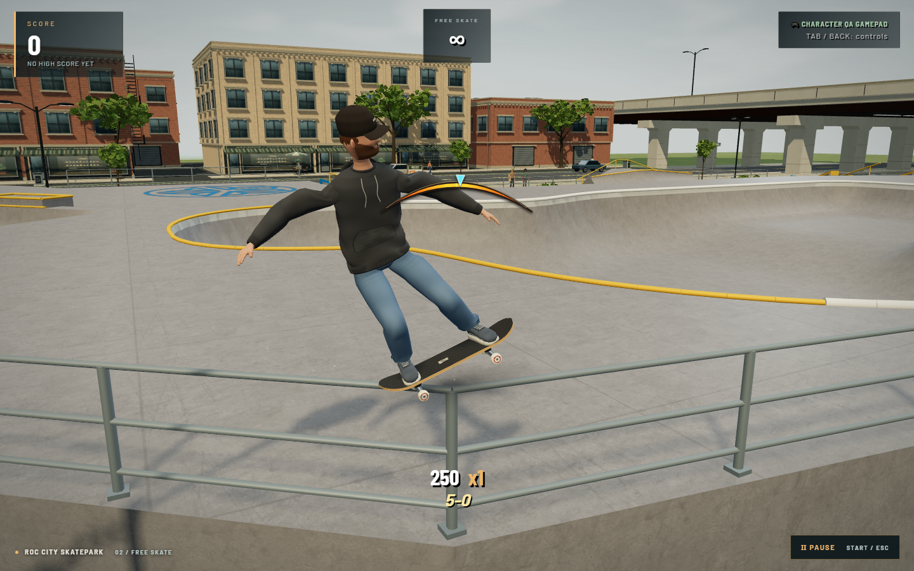
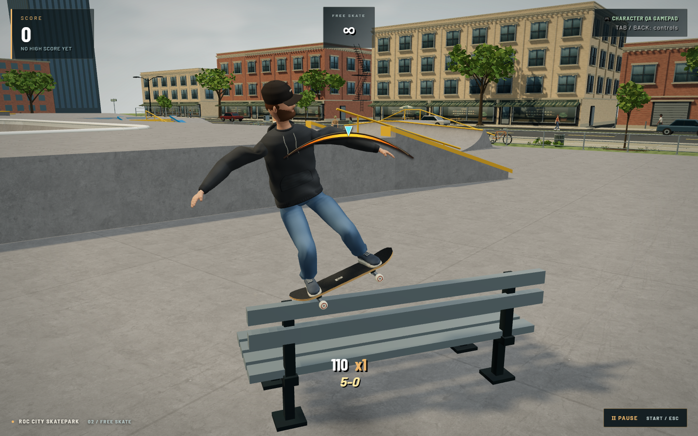
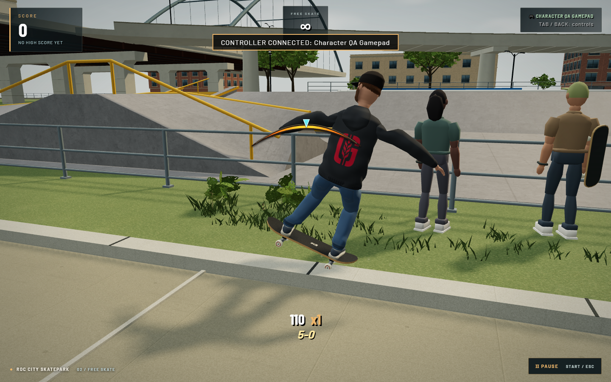

# ROC City street grinds

Use the existing Grind control while airborne near an edge. The new routes are:

- Both sides of each parked car: linked trunk, rear pillar, roof, front pillar and hood edges.
- Fence tops around the decks, north entrance, east side and river, plus the underbridge chain-link fence and rear quarter guardrails.
- Front seat lips and backrest tops on both park benches.
- Both edges of the South Avenue curbs and the land-facing river-wall coping.

Cars now have solid, rideable bodywork. Their visible meshes and physical
surfaces use the same geometry factories. Car dimensions remain human-sized
when the park footprint is scaled. Fence/bench descriptors likewise drive both
rendering and collision, with supports ending below their grind surfaces.

The 51 new rail segments register during level construction, so loading or
removing decorative art, changing effects quality, or rebuilding a level cannot
change available routes. Connected car/fence segments carry the same trick,
balance meter and combo through corners. Rail metadata preserves flat versus
round contact for the existing trick-specific animations.
On the short, steep car pillars, the board follows the bodywork while the
rider's body stays balanced within a 22-degree base tilt and smoothly changes
orientation. This avoids the nearly horizontal rider pose found in motion QA.
Both characters, all nine grinds, both directions and both stances retain their
board contact and planted shoes across all five car sections.

Street-object capture requires deliberate Grind input and stays within 65 cm
horizontally. Existing skatepark rails retain their original assistance. This
prevents distant fencing from stealing ledge and A-frame approaches or turning
an ordinary quarter-pipe air into an unwanted grind. An Ollie dismount ignores
the departed object's edges until landing or a fresh Grind press; holding Grind
can still transfer to a different object.

`npm run sim:street-grinds` exercises real input approaches, linked traversal,
both travel directions and regular/fakie, dismounting, collision, visible contact
alignment and desktop/low-effects invariance. `npm run qa:street-grinds` captures
the running production build in an isolated browser using actual gamepad/touch
input. The warehouse, score definitions, controls and saved progress are unchanged.

The routes are authored on the useful upper edges, rather than every tiny trim
piece. Cars remain parked props; there is no vehicle motion or damage simulation.
Mobile browser emulation is covered; physical-phone performance is not measured.

## Verification

The [physics report](screenshots/street-grinds/physics-report.json) passes 18/18
checks: 32 approach/grind/exit/bank routes, deliberate curb dismount/regrind,
solid car/fence collision and unarmed quarter-pipe airs at both world scales.
All five linked car sections are visited. Of 612 rendered-edge samples, the
largest target-to-mesh difference is 2.28 mm.

The scale suite passes all 15 checks, including car placement with unchanged
physical size. Existing ledge/A-frame approaches, quarter copings, progress,
warehouse, touch, scoring, environment lifecycle and trick-pose checks pass.

## In-game captures

The baseline comes from the public version 17 build: its car approach passes
through decorative bodywork without registering a grind. The new captures show
actual controller-driven routes; contact views use a closer diagnostic camera.

| Before: decorative car | After: car 5-0 |
| --- | --- |
|  |  |

| Fence | Bench | Curb |
| --- | --- | --- |
|  |  |  |

The [production-browser report](screenshots/street-grinds/after/report.json)
records all four approaches, sustained grinds, exits and banked scores, with no
bails or browser errors. Only representative captures are committed.

The final [car posture and touch report](screenshots/street-grinds/car-fixed/report.json)
passes 3/3 additional checks after the body-tilt correction. Controller and native
touch routes cross all five car sections and bank 180 points. The largest body
tilt observed on the rear pillar is 20.95 degrees; the contact solve is unchanged.
The [four-second gameplay clip](screenshots/street-grinds/car-fixed/paced-car.webm)
was replayed at normal speed and visually reviewed.
