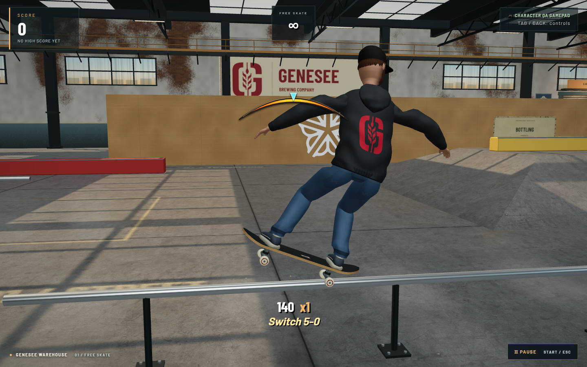
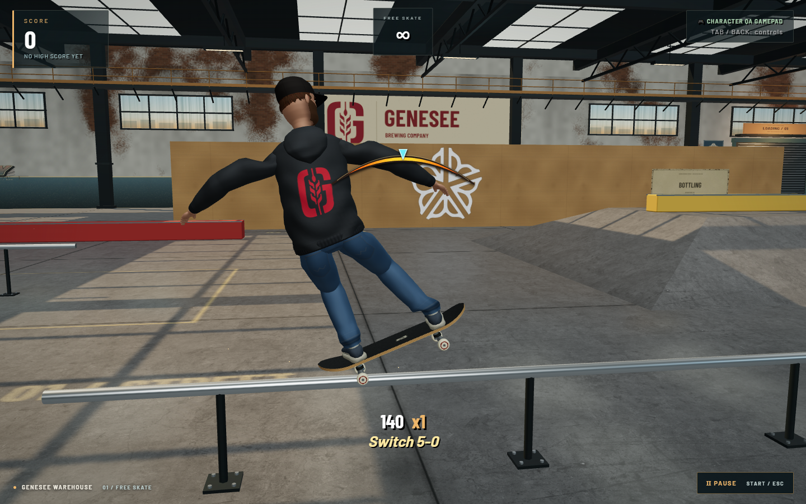
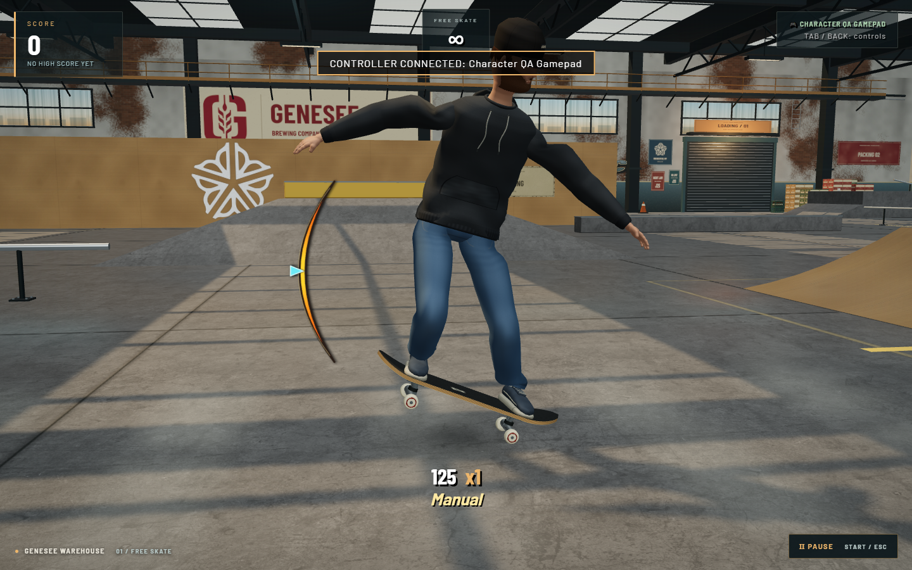
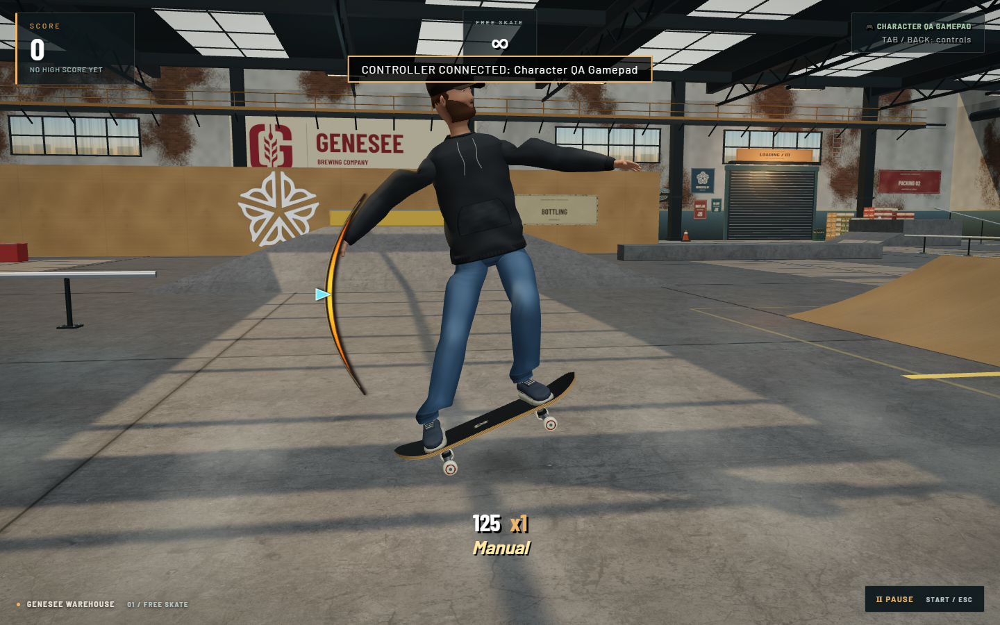

# Switch stance and diagonal grinds

Feeble now uses down-left; Smith uses down-right. Both retain their 125-point
base score. The controls reference matches the mapping.

The renderer previously kept the same physical end of the deck loaded after
travel reversed. Switch 5-0 consequently stood on the leading truck. Manuals
also had an independent lean-sign error: regular Manual loaded the front wheels,
while switch Manual happened to look correct because the two errors canceled.

Board support, balance poses and front/rear limb roles now follow travel. A 5-0
or Manual loads the trailing truck/wheels; a Nosegrind or Nose Manual loads the
leading pair. The anatomical rig frame stays unchanged. Grabs exchange front
and rear hand/foot roles, with reflected board and grip positions that retain
the toe/heel edge. Departing grabs keep their original hand until release, even
when landing changes stance. Push posture, carve lean and flip poses follow the
leading leg. A held manual rocks through level during a revert instead of
flipping its pitch in one frame.

No physics, trick detection, scoring, save format or control timing changes.
Existing stance-aware manual flick directions remain the same.

## Validation

- `npm run sim:switch`: seven checks, 224 actual input sequences and 9,136
  immutable render frames. Covers 48 manuals, 144 captured grinds and 32 held
  manual reverts across both characters, stances, directions and rail slopes.
  Contact assertions inspect rendered wheel/hanger vertices ordered along
  physical travel, separately from the animation helper's contact metadata.
- Grind poses: 9 checks; grab poses: 10 checks; trick transitions: 28 checks
  covering 146 real input trajectories and 30,660 rendered frames.
- Push: 1,440 frames; foot planting: 7,059 contacts across 6,499 frames.
- Reverts, scoring, character persistence/rig parity and touch input regressions
  pass. Production build succeeds with the existing large-bundle warning.
- Production browser: 23 checks, including native regular/switch approaches,
  manual flicks, grind captures and exits, both diagonal inputs, switch push/grab,
  nose contacts, a paced manual-to-revert sequence and touch input. No browser
  errors. Mobile validation is browser emulation, not physical-device testing.

The independent numerical report is
[`physics-report.json`](screenshots/switch-stance/physics-report.json).
The browser harness uses native gamepad polling, an actual ground revert,
manual flicks and charged ollie/grind inputs. The baseline is the previously
published production bundle, with known visual defects recorded rather than
asserted as correct. Fresh production evidence is under
[`screenshots/switch-stance`](screenshots/switch-stance).

## Compared views

Both switch 5-0 images travel toward screen-right. The corrected pose loads the
trailing truck and raises the leading truck. These are actual input-driven
captures using the same relative camera angle.

| Before | After |
| --- | --- |
|  |  |
|  |  |

[Recorded switch manual and live revert](screenshots/switch-stance/after/paced-switch-manual.webm)
uses the gameplay camera and was replayed at 1×. The capture is 3.117 seconds
for a 4.091-second paced input sequence, so the clip is pose evidence rather
than a frame-timing measurement. Close views and native touch evidence accompany
[`after/report.json`](screenshots/switch-stance/after/report.json).

The existing procedural rig still uses simplified joints and mirrored authored
poses rather than motion capture or a separate goofy-footed character model.
