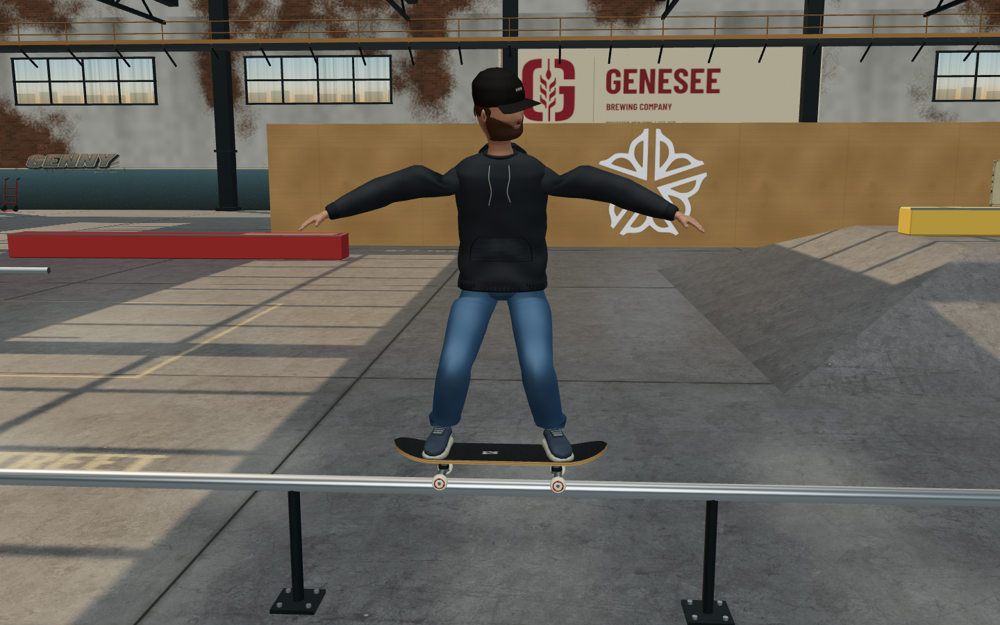
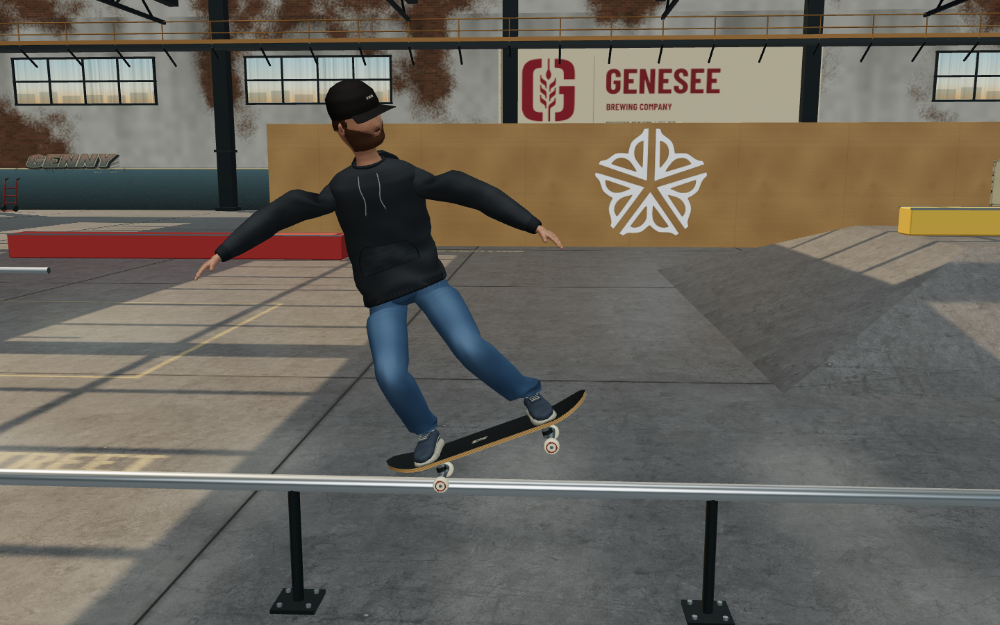
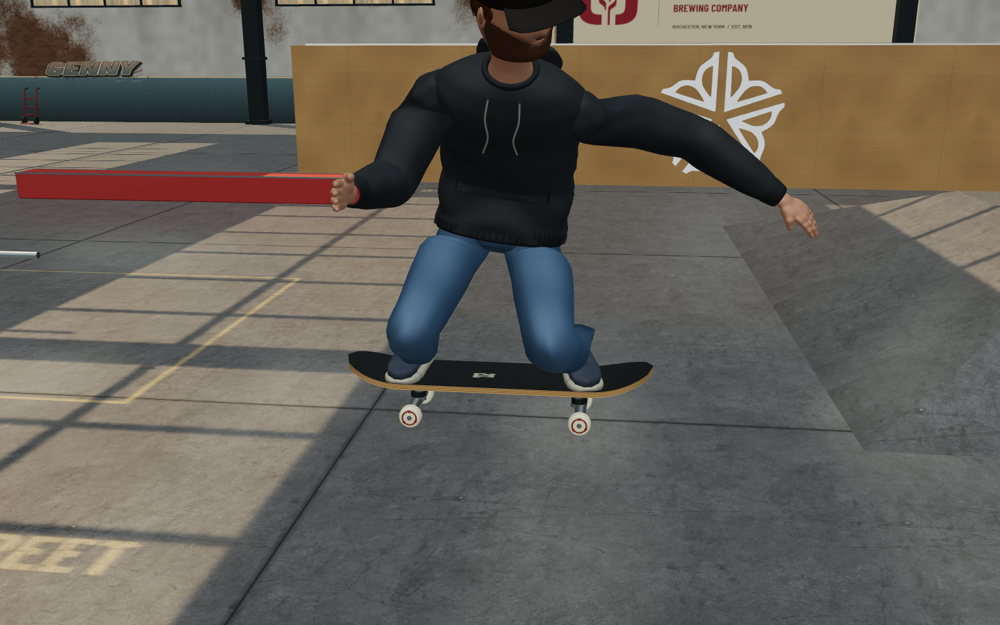
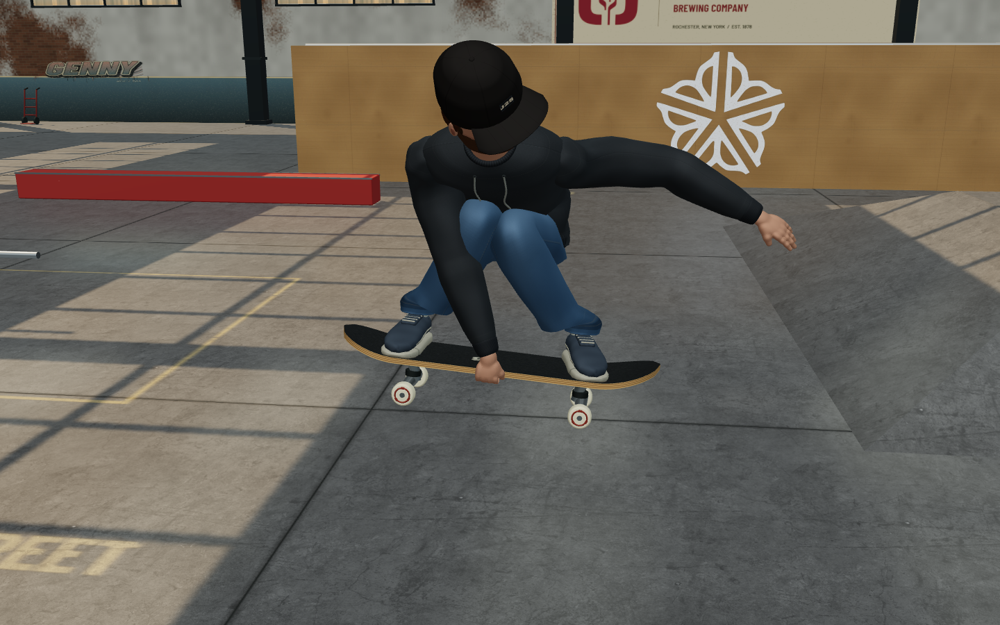

# Grind and grab contact animation

The rendered rider now performs the trick selected by the existing scoring state.
This is a visual change: trick definitions, inputs, scoring, collision, jump
trajectories, level progress and the regular/fakie simulation are unchanged.

## Grind coverage

| Scored trick | Visible support and balance |
| --- | --- |
| 50-50 | Both truck hangers on the rail; board follows its slope. |
| 5-0 | Rear hanger loaded; nose and front truck raised. |
| Nosegrind | Front hanger loaded; tail and rear truck raised. |
| Boardslide | Rail under the middle of the deck; board across the rail. |
| Lipslide | Same middle-deck support, with the opposite shoulder/arm twist. |
| Crooked Grind | Diagonal front-truck pinch; raised tail. |
| Overcrook | Opposite-side diagonal front-truck pinch. |
| Smith Grind | Rear hanger loaded; nose lowered beside the rail. |
| Feeble Grind | Rear hanger loaded; front truck lowered on the opposite side. |

`src/grind-animation.js` constructs a frame from the actual rail axis, preserves
the anatomical nose while travelling fakie, and solves the board translation
around the loaded hanger or deck contact. Cylinder contact accounts for hanger
radius, rail radius and ROC City's nonuniform XZ scaling. Painted rectangular
ledges use their actual top surface instead of an assumed round tube.

The board stays supported during entry. Smith/Feeble move the front truck aside
before dipping it. The rider blends into the rail frame separately, with foot IK,
hip loading, torso twist, bent knees and individual balance-arm poses. Departing
rail corrections decay underneath the next air trick rather than replacing it.

## Grab coverage

The current rig is regular: left hand/foot lead, right hand/foot trail. Fakie
reverses travel, not anatomy.

| Scored trick | Hand contact | Body and feet |
| --- | --- | --- |
| Indy | Rear hand, toe edge between the feet | Forward tuck; both feet planted. |
| Melon | Front hand, heel edge | Board pulled toward the hand; both feet planted. |
| Nosegrab | Front hand, raised nose rim | Nose brought up within reach. |
| Tailgrab | Rear hand, raised tail rim | Opposite end of the board brought up. |
| Method | Front hand, heel edge | Open chest, folded knees, board behind the rider. |
| Stalefish | Rear hand, heel edge ahead of the rear foot | Reach behind the rear knee, with shoulder/torso twist. |
| Judo | Front hand, nose | Front foot kicks across the toe side; rear foot stays planted. |
| Airwalk | Front hand, nose | Both feet leave the board and split forward/back. |

`src/grab-animation.js` blends a separate whole-body profile for each grab.
Two-bone arm IK targets a point on the sculpted palm, not the wrist origin. The
target is transformed with the rendered board, so it remains attached during
spins and tilted airs. Foot IK keeps ordinary grabs planted and gives Judo and
Airwalk their own released-foot targets. Reach, hold and release follow the
existing trick lifetime, including its minimum duration after a quick button tap.
An owned hand morph curls the fingers beneath the rim and opens them on release;
it leaves the palm landmark and neutral hand vertices unchanged.

Descending grabs use independent visual landing probes to extend before impact.
The score can still record a held grab while the rider prepares to land. Starting
a flip carries the departing board offset and foot orientation into its initial
frames, then releases them, without changing the new flip's timing or rotation.

## Matching views

| 5-0 before | 5-0 after |
| --- | --- |
|  |  |

| Indy before | Indy after |
| --- | --- |
|  |  |

These are matching diagnostic camera positions, not photo composites. The
separate [grab clip](screenshots/trick-visuals/final/paced-grab.webm) and
[grind clip](screenshots/trick-visuals/final/paced-grind.webm) use the normal
follow camera and paced controller input.

## Reference review

These are pose and contact references, not copied game assets. Numerical angles,
blend times and tuck distances are animation choices for this rig, not measurements
extracted from photographs.

- SkateDeluxe's original [50-50](https://www.skatedeluxe.com/blog/en/trick-tips/skateboard/curb-rail/how-to-50-50/),
  [5-0](https://www.skatedeluxe.com/blog/en/trick-tips/skateboard/curb-rail/how-to-5-0/),
  [Nosegrind](https://www.skatedeluxe.com/blog/en/trick-tips/skateboard/curb-rail/how-to-nosegrind/),
  [Crooked](https://www.skatedeluxe.com/blog/en/trick-tips/skateboard/curb-rail/how-to-bs-crooked/),
  [Smith](https://www.skatedeluxe.com/blog/en/trick-tips/skateboard/curb-rail/how-to-fs-smithgrind/),
  [Boardslide](https://www.skatedeluxe.com/blog/en/trick-tips/skateboard/curb-rail/how-to-bs-boardslide/)
  and [Lipslide](https://www.skatedeluxe.com/blog/en/trick-tips/skateboard/curb-rail/how-to-fs-lipslide/)
  photos and instructional sequences. The [BS Crooked video](https://www.youtube.com/watch?v=E2-aLE2HZ1w)
  was also watched at normal speed through approach, pinch, release and landing.
- Red Bull original photographs: [Luiz Neto's frontside overcrook, Lukas Wagneter](https://www.redbull.com/int-en/mystic-skate-cup-highlights-2018)
  and [Jamie Foy's frontside feeble](https://www.redbull.com/us-en/galleries/5for5-jamie-foy-gallery-c3).
- [Skateboard Deutschland 2020 judge manual](https://skateboarddeutschland.de/wp-content/uploads/2020/07/Judge-Manual-SKD-05-07-2020-lowres.pdf),
  grab diagrams and the Judo photograph: nose grip and front-foot kick.
- TransWorld's [Tony Trujillo Indy](https://www.skateboarding.com/news/trick-tipindy-grabs-with-tony-trujillo),
  [Mike Vallely Melon](https://www.skateboarding.com/archives/starting-point-1)
  and [Stalefish](https://www.skateboarding.com/archives/starting-point-stalefish-grab) instruction.
- [Neil Blender interview, Slam City](https://blog.slamcity.com/neil-blender-interview/amp/):
  Grant Brittain's Method photograph guided the heelward board and open chest.
- [Tony Hawk's 1985 Airwalk, Doug Pensinger/Getty](https://www.gettyimages.com.br/detail/foto-jornal%C3%ADstica/tony-hawk-riding-for-powell-peralta-does-an-airwalk-foto-jornal%C3%ADstica/89148591):
  nose grip and split feet.

## Review method and limits

Browser captures use the actual character meshes, actual rail geometry and the
existing trick selection methods. Fixed close views isolate contact; separate
controller-driven runs exercise the real physics and scoring at gameplay camera
distance. Both Joe and Aaron, every supported grab/grind, fakie, sloped rails,
rotated airs and return to riding are covered.

The first visual pass revealed excessive leg tuck despite mathematically correct
hand contact. Board height, pelvis position and torso lean were revised. A Method
knee-pole experiment was rejected because it twisted the knees and snapped on
release. Independent review also tested actual held-grab landings and legal
grab-to-flip input sequences rather than relying on static pose tests.

The rig remains a stylized procedural character, not motion capture. It has no
soft-body clothing or full anatomical joint limits. Frontside/backside approach
history is not recorded by the existing scoring state: Boardslide and Lipslide
therefore share their physically correct held deck contact and differ in rider
twist, without inventing a scored entry-side system. There is no selectable goofy
rig; tests cover the game's existing regular/fakie behavior.
The controller can still magnetically snap the entire rider onto a nearby rail.
Animation prepares the tuck for capture, but does not smooth that physical root
movement or let the loaded truck float away from the rail after capture.

Run `npm run sim:trick-poses` for contact and transition checks. With a production
preview running, use `npm run qa:trick-poses -- http://127.0.0.1:4176 <output-dir>`
for actual-model browser checks. Set `QA_VIDEO=1` to record paced four-second
controller clips in addition to screenshots. Headless desktop rendering is not
a physical phone performance measurement.

## Validation results

- Grind tests: 8 checks, 11,109 frames and 20,890 planted-foot checks, including
  mesh-level support on the scaled ROC rails and coping.
- Grab tests: 9 checks for all eight identities, transformed palm/deck contact,
  released feet, interrupted states, short taps, character switching and owned
  finger morphs.
- [Actual-input transition report](screenshots/trick-visuals/trick-transition-report.json):
  24 checks, 106 trajectories and 22,260 render calls with unchanged simulation
  state. Covers both characters and stances, every grab's held landing/flip exit,
  every grind's charged exit, Method→Kickflip→Indy, steep quarter-pipe landings
  and held-grab rail capture.
- Footplant regression: 7,059 contacts across 6,499 frames. The expected released
  feet for Judo/Airwalk are tested separately and must return to the deck.
- Existing score (16), quarter-pipe transition (38), character (10), touch (10)
  and ROC City (101) checks passed. The mixed-animation simulation remained
  finite for 4,801 frames; the clothing test passed 665,280 cuff/shoe checks.
- [Production browser report](screenshots/trick-visuals/final/report.json):
  9/9 checks, zero browser/WebGL errors, all 17 tricks on both rigs, 204 phase
  and transform cases, native controller rollaways and touch/low-effects mode.
  Settled visible palm skin was within 1.56 mm of its intended rim point.
- Four paced four-second clips were replayed at 1× in the browser and inspected
  through live-playback screenshots. The grab, grind, quarter grab-to-flip and
  held quarter-grab routes banked 310, 150, 800 and 400 points with no bails.
  [Quarter grab-to-flip](screenshots/trick-visuals/final/paced-quarter-flip.webm)
  and [held-grab landing](screenshots/trick-visuals/final/paced-quarter-held.webm)
  supplement the flat-ground clips above.

Only representative screenshots and clips are checked in; the browser command
regenerates the full set listed in its report.

Transition measurements remove the physical root movement before comparing the
animation. In the seeded 60 Hz fixtures, the largest held-landing board step fell
from 32–39 cm to 5.9 cm, the immediate-flip step from 28–35 cm to 7.2 cm, and the
extra grab-to-rail correction from 29.4 cm to 6.8 cm. The controller's 58.3 cm
magnetic capture in that last fixture is intentionally unchanged.
