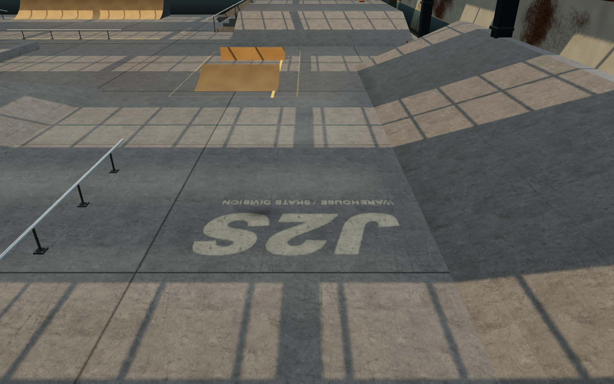
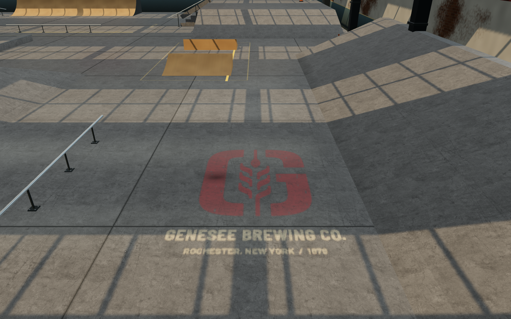
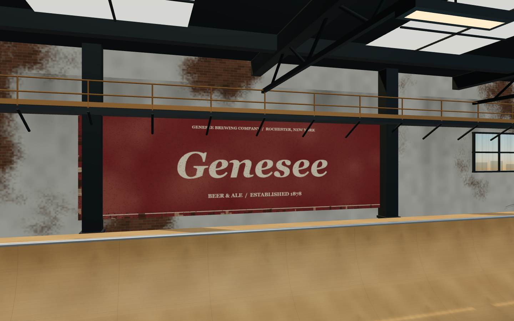
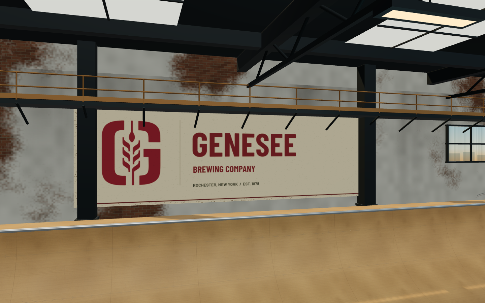
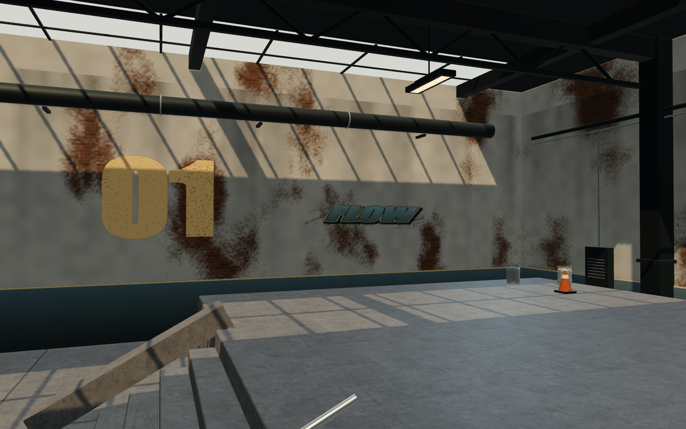
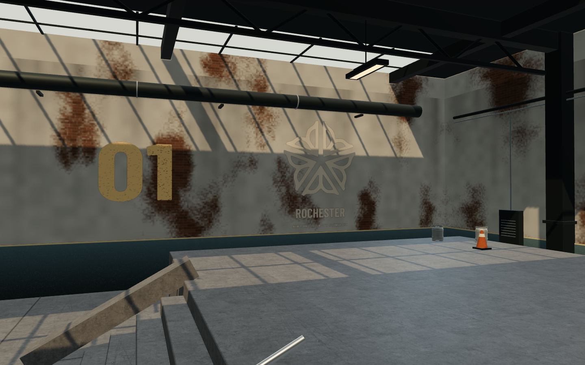
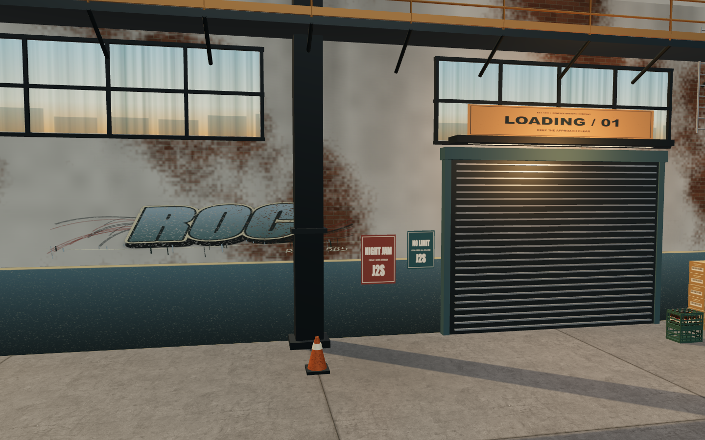
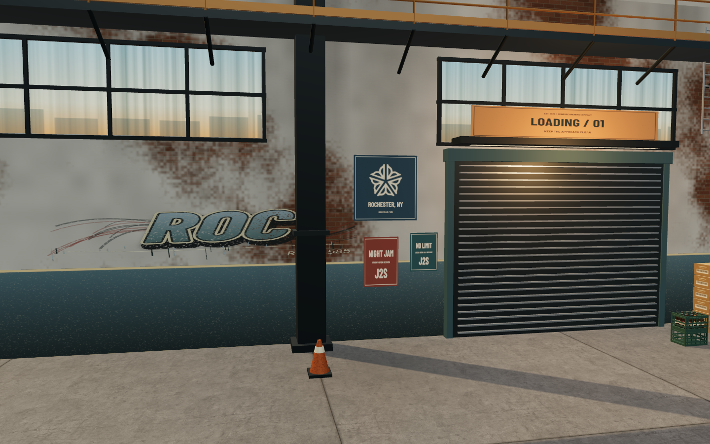
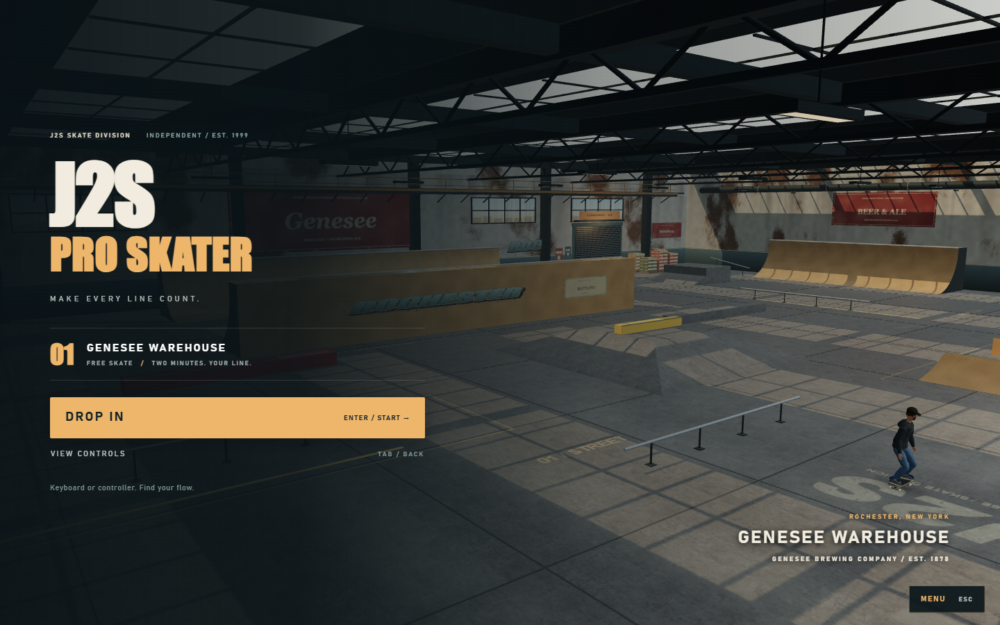
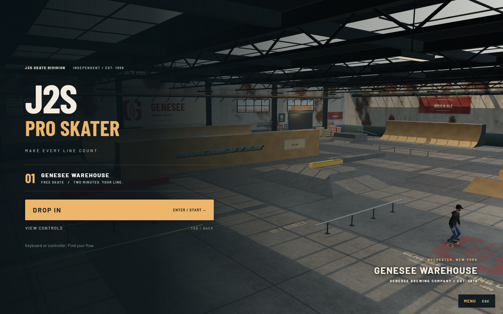

# Genesee and Rochester warehouse identity

The warehouse now has a worn red Genesee G on the floor at the starting skate line, replacing J2S. It faces the normal approach and sits in the existing concrete paint layer, so the slab grain, joints, wear and reflections remain visible through it.

The north wall has a cream-and-red Genesee G sign with brewery lettering and aged fixings. Rochester's flower mark replaces the FLOW graffiti on the east wall; two smaller blue Rochester plaques sit beside the loading-area posters, clear of the support columns.

Barlow Condensed Bold provides the industrial display lettering, and Barlow Regular/Bold supplies readable labels. They are shared by warehouse signs, title/menu screens and the HUD. Beer packaging retains its existing heritage lettering and shipping-label type. The three local WOFF2 files total 67,428 bytes and require no external service at runtime.

The startup module resolves fonts before generating the canvas signs. If fonts fail or take more than 1.8 seconds, both the UI and signs use the same fallback families for that session. Late font arrival cannot leave the baked signs and UI using different typefaces.

## Sources

- Genesee G: the [brewery's website](https://www.geneseebeer.com/), reusing the existing `src/genesee-mark.js` vector from the hoodie.
- Rochester flower: [City Logo Reference](https://www.cityofrochester.gov/departments/bureau-communciations-and-special-events/city-logo-reference); [vector source](https://commons.wikimedia.org/wiki/File:Logo_of_Rochester,_New_York.svg) is recorded in `src/rochester-mark.js`.
- Fonts: [The Barlow Project](https://github.com/jpt/barlow), distributed under SIL OFL 1.1. Local licenses and download provenance are in `public/fonts/`.

## Matching views

The before set comes from an isolated copy of commit `0d7d0fccfa6d8c78b24173500e2534e23855c844`, served on port 5174. The after set comes from the production build on port 5175. Both use the same 1440 x 900 viewport, pixel ratio 1, cameras and warehouse lighting. The floor camera sits below the light fixtures, giving an unobstructed comparison. The character is hidden for environment close-ups in both sets.

| Before | After |
| --- | --- |
|  |  |
|  |  |
|  |  |
|  |  |
|  |  |

## Verification

- `npm run build` passes: 41 modules; main JavaScript 712.89 kB / 203.26 kB gzip, plus the 2.61 kB / 1.25 kB gzip startup chunk. The existing Vite warning about a chunk larger than 500 kB remains.
- `node sim/brewerytest.js` passes: 18 storage hulls, platform placement, grind clearances, four brewery access lanes and three physics approaches. No collision geometry changed.
- All 23 checks in `sim/visual-live.playwright.js` pass on the production build: both push stances, keyboard and simulated-controller flips/landings, rail sparks, ledge dust, replay, controls, responsive title screens and lowfx. No runtime, shader or WebGL errors.
- All 44 checks in `sim/pause-menu.playwright.js` pass on the production build, including frozen physics/animation/timers, resume/restart, keyboard/controller navigation and phone/landscape/desktop layouts with the new fonts.
- `sim/identity-check.playwright.js` passes normal, unavailable and late-font scenarios on port 5175. It verifies the actual canvas font selections, UI agreement, local asset requests, rendering and keyboard-driven skating.
- A 360-frame production gameplay sample measured median 16.7 ms and p95 16.8 ms on this machine. This is a diagnostic sample, not a performance guarantee for other devices.

The same overview camera, with the character hidden, changes from 148 to 149 draw calls, 147,854 to 147,858 triangles and 76 to 77 resident textures. The two loading plaques share one material. The floor mark adds no draw call or texture allocation.

Reproduce the six matching views with `sim/identity-capture.playwright.js` through Playwright's `browser_run_code_unsafe` filename argument. The default URL is the dev server on port 5173; substitute the desired port/output folder for baseline or production runs. Redirect the existing live and pause scripts' output directories to `screenshots/identity-after/live/` and `screenshots/identity-after/menu/` to preserve earlier evidence. Results are saved in `screenshots/identity-after/results.json`.

The marks use static paint and sign textures. The floor retains its existing atlas resolution, so small lettering softens at extreme close-up. These are environment decorations and do not change skating physics or the character.
